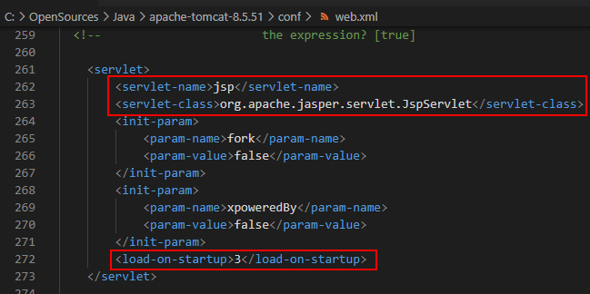
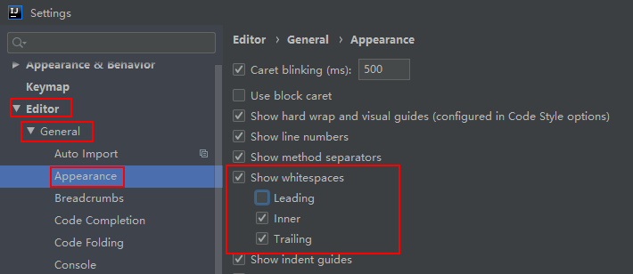

# Java基础

## 常识

### 源文件

- 文件名必须与公共类名一致
- 严格区分大小写
- 一个源文件只能有一个公共类：public class{}
- 单个源文件可以有多个类，一个类对应一个字节码文件

### 标志符  

- 由字母、数字、下划线、$组成，但不能以数字开头（注：此处的字母可以是中文、日文等）
- 大小写敏感
- 不得使用java中的关键字和保留字
- 不用java中内置的类名作为自己的类名。
- 类名必须使用名词，且首字面必须是大写的
- 常量命名规范：所有字母大写，多个字母直接使用_分割

### 注释

- 单行注释
  - // 内容
- 多行注释
  - /* 内容  */

### 常用工具

- javac：编译操作
- 启动JVM并加载字节码文件

### 跨平台性

- 编译后的class字节码文件
- 虚拟机（JVM）不跨平台

### 方向

- JavaSE：桌面：eclipse	
- JavaME：微型、移动端
- JavaEE：企业网站

### 历史

- 1995年诞生
- 前身：SUN公司
- 现任：Orade公司，俗称甲骨文


---


## 变量和运算符

### 变量特点

- 占据着内存中的某一块存储区域
- 该区域有自己的名称（变量名）和类型（数据类型）
- 可以被重复使用
- 该区域的数据可以在同一类型范围内不断变化

### 变量类型转换

- 自动转换：小类型→大类型
  -  (byte、short、char)→int→long→float→double
  - byte、short、char自动转为int再参与运算
  - 参与运算的类型最大的类型为最终结果类型
- 强制转换：大类型→小类型
  - 小类型 变量 = （小类型）大类型变量
  - 小类型 变量 = （小类型）（含大类型表达式）
- float类型4字节转long类型8字节，需要强转

### 注意

- 变量必须先声明，并且初始化后才能使用
- 定义变量必须有数据类型
- 变量从开始定义到所在的花括号结束之内可以使用，离开花括号就不能使用了
- 同一作用域内，变量名不能重复定义

### 运算符

### 算术运算符

```java
//加减乘除
System.out.println(1 + 2);//3
System.out.println(1 - 2);//-1
System.out.println(1 * 2);//2
System.out.println(1 / 2);//2
//取模求余
System.out.println(13 % 2);//1
```

- 自增自减
  - ++变量：先自增（减）再使用
  - 变量++：先自增（减）再使用

### 赋值运算符

```java
int a;
//=和+=（-+、*=、/=）的区别
a = (int)3L;
a += 3L;
```

### 比较运算符

boolean  result  = 表达式A  比较运算符  表达式B；


### 逻辑运算符

- &（与）：前后两个条件都判断
- &&（短路与）：条件1不成立时，后面的条件均不进行判断，返回false
- |（或）：前后两个条件都判断
- ||（短路或）：条件1成立时，后面条件均不进行判断，返回true

### 三元运算符

三元运算符，表示有三个元素参与的表达式，所以又称为三目运算符，其语义表示if-else（如果什么情况就做什么，否则做什么）。 如果...那么...否则...

```java
System.out.println(1 > 3 ? "1大于3" : "1小于3");//1小于3
```

三元运算符结果的类型由结果A和结果B来决定的，结果A和结果B的==类型相同==。

### 运算优先级

- 赋值符号是最后运算，并且是从右往左运算

### 常量

- 占据着内存中的某一块存储区域
- 该区域有自己的名称（变量名）和类型（数据类型）
- 可以被重复使用
- 定义后值不可改变

### 八大基本数据类型


## 选择与循环

### 顺序结构

### 选择结构

```java
//if、if-else、if-else if -else
if (true) {
    语句体;
}else if(true){
    语句体;
}else{
    语句体;
}
```

```java
switch(整型表达式){
	case A值:
		语句体1; break;
    ...多个case语句
	default:
		以上值都不满足时，执行此语句；
     break;//可以省略
}
```

- 整型表达式的类型：byte,short,char,int

- Java5开始支持枚举

- Java7开始支持String

- case之后的表达式结果必须是常量

- switch的穿透效果

  ---

### 循环结构

```java
while(boolean表达式) {
    循环体;
}
//do-while会先执行一次do再进行条件判断
do
{
   循环体;
}
while(boolean表达式);
```

```java
for(初始化语句; boolean表达式; 循环后操作语句){
	循环体;
}
```


### 控制循环

```java
break : 结束当前所在的循环
return : 结束当前循环所在的方法
continue : 跳过当前这一次循环，执行循环之后的操作语句，进入下一次循环操作
```


---


## JVM内存模型


- ==方法区==
  - 存储已被JVM加载的类信息
  - 存放的是对象的方法，即使new出多个对象也是只是存在一个方法。
- ==堆==
  - JVM启动时创建。
  - new关键字，表示在堆开辟一块新的存储空间。
  - new出的对象只包含成员变量。
- ==栈==
  - 方法被执行时会同时创建一个栈帧 ，存放局部变量，方法调用完了，栈帧也就被销毁了。
  - 存放的是局部成员变量。
  - 对于基本的数据类型存放的是基本变量的值，而对于对象变量，存放的是堆内存的地址。
- ==静态、常量区==
  - 存放的是静态变量(类变量)或是常量。


程序启动后，首先方法区加载class对象，然后在栈中开main方法栈帧，然后在栈帧中存储变量，变量中存放堆里值的地址。


## 数组

```java
//静态初始化
int[] nums = new  int[]{1,3,5,7,9};
//简写
int[] nums = {1,3,5,7,9};
//动态初始化
int[] nums = new int[5];
```


### 数组操作

```java
//for
for (int i = 0; i < nums.length; i++) {
    System.out.println(nums[i]);
}
//for-each
for (int ele : nums) {
    System.out.println(ele);
}
```


### 多维数组

```java
//静态初始化
int[][] nums = {
    {1,3,5,7,9},{1,3,5,7,9},{1,3,5,7,9}
};
//动态初始化
int[][] nums = new int[5][6];
```


### 数组高级操作

​	数组拷贝
​	排序操作
​	二分法查找

----

**==整理笔记到这里==**

---

### 操作数组（API）

​		Arrays.toString：打印数组元素
​		System.arraycopy：拷贝数组元素
​		Arrays.sort：数组元素排序
​		Arrays.binarySearch：数组元素二分查找

## 方法

### 返回值

​	方法需要返回值的时候，无论什么情况都要有返回

### 可变参数

​	本质是一维数组
​	必须作为方法的最后一个参数，避免多个参数的歧义性

### 重载

​	类、方法名相同，方法参数列表不同
​	参数类型、个数、顺序不同，都叫参数列表不同
​	屏蔽同一功能的方法由于参数不同所造成方法名称不同
​	方法重载和方法的返回值类型无关，只是一般要求返回值类型相同。

### 递归

​	方法内部调用方法本身
​	必须要有出口

### 基本类型参数传递

​	传递参数，不影响原参数

### 引用类型参数传递

​	传递引用地址，值改变，都改变

## 面向对象

### 类和对象

​	类
​		对某一类事务的抽象描述（特性、行为）
​		使用成员变量表示状态
​		使用成员方法表示行为
​	对象
​		表示某类事务的个体，也称之为对象的实例
​	类可以看做对象的数据类型

#### 注意

​	成员变量、方法都不能用static修饰，修饰符是可选用的
​	描述对象的类和测试类分开写
​	描述对象的类不需要定义main方法，在测试类中提供main方法（责任划分）

#### 封装

​	访问修饰符
​		private：当前类私有的，类访问权限，只能在本类中操作，离开本类之后就不能直接访问
​		不写（缺省）：当前包私有，包访问权限，定义和调用只能在同一个包中，才能访问
​		protected：子类访问权限，只要存在继承关系，那子类都可以继承
​		public：公共的，可以在当前项目中任何地方访问
​	JavaBean规范
​		类必须使用public修饰
​		必须保证有公共无参数构造器，即使手动提供了带参数的构造器，也得手动提供无参数构造器
​		字段使用private修饰(私有化)，每个字段提供一对getter和setter方法
​		getter方法(get)
​			无形参
​			仅仅用于返回某一个字段的值
​		setter方法(set)
​			有且仅有一个形参
​			仅仅用来给某一个字段设置值

#### 构造器

​	创建对象、给对象做初始化操作
​	默认构造器
​		无参数
​		无方法体
​		无返回
​	类中可以有多个构造器（重载）
​	有参构造器
​		创建对象，为成员变量赋值
​		注意形参跟成员变量同名时的赋值（就近原则）

#### 变量

​	成员变量
​		类里面，方法外面，又称字段
​		byte、short、int、long：0
float、double：0.0
char：空格(\u0000)
boolean：false
引用类型：null，不引用任何对象

#### 局部变量

​		方法内
​		方法的形参

#### 作用域

​		代码块中（花括号内）
​		就近原则（从内到外顺序访问）

### 继承，抽象类

#### this

​	规避局部变量和成员变量存在二义性
​	指向当前对象

#### 有参构造器、setter方法

​	构造器在创建对象并会初始化一次成员变量
​	setter方法在对象被创建后可多次设置成员变量

#### 继承

​	被继承的类，称之为父类、基类
​	继承父类的类，称之为子类，拓展类
​	父类：存放多个子类共同的字段和方法
​	子类：存放自己特有的字段和方法

#### 属性

​	属性由getter、setter方法决定
​	属性名：去掉getter、setter方法的方法名中的get、set并且首字母小写

### 重写

​	方法跟父类完全一样，方法体不一样

#### supper

​	调用父类中被覆盖重写的方法
​	指向当前类的父类对象

### 抽象方法、抽象类

​	抽象(abstract)方法
​		该方法没有方法体
​		约束子类必须覆盖该方法
​		必须定义在抽象类或接口中
​	抽象类
​		一般以Abstract作为类名前缀，如AbstractGraph
​		抽象类不能创建对象，调用没有方法体的抽象方法没有任何意义
​		抽象类中可以同时拥有抽象方法和普通方法
​		抽象类要有子类才有意义，子类必须覆盖父类的抽象方法，否则子类也得作为抽象类

#### Object

- z在根类中，equals是通过==进行比较判断
- == 比较引用是否相等（它们是否是同一对象）
- 一般重写后的equals是比较值是否相等（逻辑上是否相等）

#### toString

- Object中的toString打印地址信息，根据需要重写
- println()方法底层有调用到toString，所以我们不用手写toString了

### 接口、多态

#### interface（接口修饰符）

​	习惯以大写i为接口名前缀
​	接口的抽象方法默认是public和abstract修饰，所以可以省略不写
​	可多继承其他接口
​	默认实现方法（子类可不覆盖）
​		default修饰
​			定义对象后通过对象调用
​		static修饰
​			在实现类中调用或者通过接口名调用

#### 接口实现类

​	implements（实现关系）修饰符
​		因为接口不能创建对象，所以要定义类来实现接口，并覆盖接口的方法
​	可以多继承接口
​	同时还可以继承别的类

#### 多态

​	操作继承关系
​		父类 变量名 = new 子类( );
变量名.方法( );
​	操作实现关系
​		接口 变量名 = new 实现类( );
变量名.方法( );
​			拓展性强
​	编译运行
​		编译时期
(先去找父类方法)
​			运行时期
(再去找子类方法)
​				运行子类方法
​				运行父类方法
​			编译失败
​	类型转换（多态）
​		自动类型转换
​			把子类对象赋给父类变量
​		强制类型转换
​			把父类类型对象赋给子类类型变量（该对象的真实类型应该是子类类型）
​		ClassCastException
​			类型转换异常
常见于强制转换中
​	instanceof运算符
​		语法：boolean b = 对象A   instanceof  类B; 
 判断 A对象是否是 B类的实例？如果是,返回true

## 面向对象查缺补漏

### 代码块

​	直接使用{}括起来的一段代码区域
​	局部代码块
​		 直接定义在方法内部的代码块
​	初始化代码块（构造代码块）
​		直接定义在类中，创建对象时都会执行
​			初始化操作更多是放在构造器中完成
​	静态代码块
​		static修饰的初始化代码块。类的字节码被加载进JVM，static代码块执行
​			开发中，用来做加载资源、
加载配置文件等操作
​		在JVM中，同一个类的字节码最多只有一份
（第一次访问时）
​	执行顺序
​		类加载 → 静态代码块 → main方法 → new对象就会执行到初始化代码块 → 构造器内局部代码块→被调用方法内的局部代码块

### 内部类

​	静态内部类
​		使用static修饰的内部类，那么访问内部类直接使用外部类名来访问
​	实例内部类
​		没有使用static修饰的内部类，访问内部类使用外部类的对象来访问
​	局部内部类
​		定义在方法中的内部类，一般不用
​	匿名内部类
​		特殊的局部内部类，适合于仅使用一次使用的类

### 匿名内部类

​	new  父类构造器([实参列表]){  
​          //匿名内部类的类体部分
}
​	new  接口名称(){ 
​           //匿名内部类的类体部分
​           //必须覆盖接口中的方法
}
​	像new匿名对象一样使用

### 枚举

​	public enum  枚举类名{
​      常量对象A, 常量对象B, 常量对象C ;
}
​	不可创建对象
​	常量都是全局公共的，可以直接枚举类名调用
​	直接继承java.lang.Enum类
​		name方法：返回枚举常量名
​		ordinal方法：返回枚举对象的常量名，从0开始
​		数据类型  变量名 = 枚举类名.常量对象名.Enum方法名()；

### static

​	直接使用类名调用，建议
​	也可以被类的对象使用到，不建议
​	静态方法当中不可以访问到非静态方法
​	不能用this、super
​	储存在方法区

### this

​	调用类中其他方法可不写，但建议写
​	调用其他构造器
​		eg：无参构造器调用有参构造器（需要给特定默认值的时候）

### super

​	调用被覆盖的父类方法
​	子类构造器的第一行，默认都是调用父类无参构造器

### final

​	修饰类：不可被其他类继承
​	修饰方法：不可被覆盖
​	修饰变量：不可被重新赋值
​		例：能修改引用数组的值，但不能更改变量的引用关系

## 常用类

随机数
	Math类
		max返回最大值
		min返回最小值
		random返回[0,1)的随机小数，底层用到Random类的方式
	Random类
		伪随机数
	UUID
		通用唯一标志符
		算法是通过电脑网卡，当地时间，随机数等组合
		优点：真实的唯一性，但字符串太长了，需要截取

日期
	Date类
		日期时间类，表示特定的瞬间，如年月日时分秒
		util包
		sql包
			不用
	SimpleDateFormat类
		日期的格式化类
		格式化：Date类型转String类型：
String format(Date date) 
		解析：String类型转Date类型：
Date parse(String source)  
			简单类型数据转为复杂类型数据
		applyPattern指定格式方法
			y：年  ； M：月份  ； d：月份中的天数
H：； m：分 ；  s：秒
			yyyy年MM月dd日  HH时mm分ss秒
输出：2020年07月22日  11时53分23秒
	Calendar类
		日期设置类
		调用方法获得对象，进而调用对象方法
		get
		set
		add

正则表达式
	简写为regex、RE
	反斜线“\” ：转义符
	String中的matches方法：判断指定的字符串是否匹配后面指定的规则
	

```
逻辑运算符
	有次序
```

字符串
	String
		对象内容不可变
		直接赋字面量：直接存放在方法区常量池
		通过构造器创建：new了新对象在堆中，字符串依然存放在常量池中
		trim方法去除前后空格，以及ASCII码中编码小于等于\u0020的字符
		subString区间截取字符串时，注意是前闭后开区间
		contains方法：字符串包含指定char值时返回true
	StringBuilder、StringBuffer
		对象内容可变
		append方法拼接字符串
默认长度16，超出长度后会自动扩容

包装类
	可以理解为对应的基本数据类型的工具类。
为了增强基本数据类型，比如表示null、使用某些方法
		基本数据类型对应包装类
			int：Integer
			char：Character
			byte、short、long、float、double、double都是首字母大写
	装箱、拆箱
		装箱：把基本数据类型转为对应包装类对象
		拆箱：把包装类对象转成对应的基本数据类型
		有横杠的方法是过时的，不建议使用
	缓存设计
		将常用数据缓存起来，使用的时候就不需要每次都创新的对象，提高性能
		Byte、Short、INteger、Long的缓存范围： 【-128,127】
Character：【0,127】
	BigDecimal
		不能直接赋值、运算，要通过构造器传递数据，且必须通过字符串类型的构造器才能达成高精度
		add：加法  ， subtract：减法
multiply：乘法  ， divide：除法
			除不尽时会报错。需要做小数位数保留
			setScale方法取整、保留小数位数
参数一：保留位数  ， 参数二：精确算法

工具类
	包名：util、utils、tool、tools
类名后缀：Util、Utils、Tool、Tools
	如果工具方法用public static修饰，就要私有化构造器，避免创建对象，节约内存
	没有用static修饰，就要设计为单例模式，通过对象调用方法
	公共静态方法
	单例模式
		保证在整个应用中某一个类有且仅有一个实例（一个类在堆中只有一个对象）
		饿汉式
			私有化构造器，防止外界随意创建对象
			事先创建一个私有静态化的当前类对象
			提供一个公共的静态方法，返回实现创建好的实例
		在工具类这块不占优势

## 异常处理

### 捕获异常

- 当前方法自己处理
- 当前方法抛出异常，其他方法处理
  	单个异常
    		try{}catch(){}
    			不影响try-catch外代码的执行
    			try语句块里异常语句后的代码不执行，直接跳到catch块
    			try语句无异常时，catch语句被跳过
    	多个异常
    		多个catch获取后如果还有未知错误，才建议使用Exception进行统一捕获

异常信息
	String getMessage()
		返回异常信息，一般直接打印给用户看
	void printStackTrace()
		打印异常具体信息，包含了异常信息、错误类型、错误位置，是JVM默认的异常处理机制。

finally语句块
	一般是写关闭资源的代码，确保资被释放
	try或catch或finally不单独出现
	除了try（或catch）语句块存在JVM退出代码
（System.exit(0);）外，finally块就一定执行

抛出异常
	throws
		方法自身处理不了异常，提醒调用该方法的方法做处理
		多种错误时使用逗号隔开，尽量不用Exception来笼统抛出
	throw
		需要返回一个错误结果给调用方法时，手动抛出一个具体的异常对象
		throw后面不能有语句，抛出异常对象后表示结束该方法

异常分类
	checked（编译异常）（非runtime异常）
		RuntimeException以及子类外，其他Exception及子类都是checked
		编译不通过，必须try-catch捕捉，或thows抛出
	runtime（运行异常）
		不强制要求try-catch、thows处理
		运行时才暴露异常
		JVM处理，打印堆栈信息
	自定义异常类
		继承Exception类
		继承RuntimeException类

java.lang.Throwable
	java.lang.Error：错误
		运行时JVM出问题，如系统崩溃、内存溢出等
不需要处理
		StackOverflowError：过深的（没出口的）递归或死循环，容易导致堆栈溢出，抛出该错误
		OutOfMemoryError：内存溢出或者无可用内存给GC时，JVM无法分配对象时抛出该错误
常见于new了过多对象又不释放时。
	java.lang.Exception：异常
		NullPointerException：空指针异常，调用null（空引用）对象的实例方法时
“”.equle(变量名)这种写法可以规避变量为null
		ArrayIndexOutOfBoundsException：数组索引越界异常。
		NumberFormatException：数字格式化异常
		ArithmeticException：算数运算异常，如除数为零
		classCastException：类型转换异常

## 多线程

操作线程
	join
		同步（并行变串行执行）也就是让某个线程先执行完再执行其他线程
	sleep
		让正在执行的线程进入设定时间的阻塞状态，模拟网络延迟等
	优先级
		Thread对象调用setPriority（int x）或getPriority（）来设置和获得优先级
		优先级只和获得机会次数有关，具体还是得看CPU的调度
	后台线程
		所有前台线程都死亡后，后台线程自动死亡 
		Thread对象setDaemon(true)设置后台线程
		setDaemon(true)必须在start()调用前，否则抛IllegalThreadStateException异常

线程安全性
	继承方式
		因为继承了Thread，该类就不能再有其他的直接父类了，功能拓展性很差
		从操作上分析，继承方式更简单，获取线程名字也简单
		从多线程共享同一个资源上分析，继承方式不能多个线程共享同一个资源
	实现方式
		J因为可以多实现接口，所以该类可以继承其他类，并且还可以实现其他接口（设计上,更优雅）
		从操作上分析，获取线程名字也比较复杂，得使用Thread.currentThread()来获取当前线程的引用
		从多线程共享同一个资源上分析，实现方式可以多线程共享同一个资源

线程同步
	为了避免多线程并发导致的线程不安全问题
	同步锁又称同步监听对象/同步监听器/互斥锁：确保线程能够完成原子操作，不被打断
	同步代码块
		synchronized(同步锁){
     //需要同步操作的代码
}
		一般将并发访问的共同资源作为同步锁监听对象。并且最多允许一个线程拥有同步锁，其他只能在锁外等待
	同步方法(synchronized修饰)
		对于非static方法，同步锁就是this
		对于static方法，同步锁就是当前方法所在类的字节码对象

synchronized的优劣
	好处在于保证了多线程并发访问时的同步操作，避免线程的安全性问题
	缺点就是使用synchronized的方法/代码块的性能要低一些
	原则上要尽量减小synchronized的作用域

生命周期和状态
	新建
		new，JVM分配内存并初始化成员变量
	可运行状态
		READY（就绪状态）
			线程对象调用start()后，进入线程队列排队
		RUNNING（运行状态）
			线程对象呗CPU调度器调度，执行线程体
	阻塞状态
		同步、I/Q等情况，会让出CPU资源，并暂停执行
	等待状态
		只能等另一个线程通知才可切回可运行状态，继续执行
	计时等待状态
		比等待状态多一个提示器，特定时间后自行唤醒线程对象
	终止状态
		表示线程终止，易导致死锁
		线程执行完、线程抛出未捕获Exception或Error或调用线程stop方法

线程创建、启动
	直接run只是单线程，调用start才是多线程(底层会调用run)
	run只被执行一次，资源被抢走后线程暂停，有资源时继续执行。run中代码执行完，该线程结束，会被回收
	继承Thread类
		自定义类继承Thread
		覆写run方法，创建自定义类对象
		自定义类对象调用start方法
	实现Runnable接口
		自定义类实现Runnable接口
		覆写run方法，创建自定义类对象
		把自定类的对象作为Thread类构造器参数，并调用Thread对象start方法  

进程
	内存中有独立空间的运行中的应用程序
	线程
		进程中的一个执行任务(控制单元)，一个进程中的多个线程间可共享数据
	多线程
		在同一个进程中同时运行的多个任务
	并行和并发
		并行：同一时间点执行多个任务
		并发：同一时间段中执行多个任务
	主进程main
		程序启动：main主线程 + 后台线程（维护的垃圾回收）

## 集合框架

集合
	储存的元素只能是对象（引用类型）
	数组的长度是固定的，集合的长度是可变的
	使用Java类封装出一个个容器类，使用时只需要直接调用即可，不用再手动创建容器类
	集合-->数组：list.toArray
数组-->集合：Arrays.asList(输入的数组是可变参数)

容器
	List（列表）
		允许记录添加顺序，允许元素重复
	set（集）
		不记录添加顺序，不允许元素重复
	Map（映射）
		容器中每一个元素都包含一对key和value，key不允许重复，value可以重复
严格上说，并不是容器（集合），是两个容器中元素映射关系

List接口
	规范：要求该容器允许记录元素的添加顺序，也允许元素重复
	List集合存储特点
		允许元素重复
		允许记录元素的添加先后顺序
	ArrayList类：数组列表，表示数组结构，
采用Object数组实现
		add：添加元素，指定索引时为插入操作
		size：元素个数
		get：返回指定索引的元素
		set：修改指定索引的元素值
		remove：删除指定索引元素
	LinkedList类：链表，底层采用链表算法，实现了链表、队列、栈的数据结构，表示双向列表和双向队列结构
Vector类：向量，古老的ArrayList，差别在于使用synchronized修饰
Stack类：Vector类的子类，具有后进先出(LIFO)的特点，拥有push（入栈），pop（出栈）方法

List常用API方法
	添加
		boolean add(Object e)：将元素添加到列表的末尾
			可以通过重写元素对象类中的equals方法来限定重复对象
		void add(int index, Object element)：在列表的指定位置插入指定的元素
boolean addAll(Collection c)：把c列表中的所有元素添加到当前列表中
	删除
		Object remove(int index)：从列表中删除指定索引位置的元素,并返回被删除的元素
		boolean removeAll(Collection c)：从此列表中移除c列表中的所有元素 
	修改
		Object set(int index, Object ele)：修改列表中指定索引位置的元素，返回被替换的旧元素 
	查询
		int size()：返回当前列表中元素个数
		Object get(int index)：查询列表中指定索引位置对应的元素
		boolean isEmpty()：判断当前列表中元素个数是否为0
Object[] toArray()：把列表对象转换为Object数组
boolean contains(Object o):判断列表是否存在指定对象

泛型
	使用一个标识符，比如T在类中表示一种未知的数据类型。<>称为菱形语法/钻石语法
		T：type类型
		E：element元素
		K：key
		V：value
	一般在创建对象时，给未知类型设置一个具体的类型，没有指定时，默认类型为Object类型。
	在类名后<>来声明泛型，<>里的字母表示是泛型

常见数据结构
	 数组（Array）
	链表（Linked List）
	哈希表（Hash）
	栈（Stack）
	队列（Queue）
	 树（Tree）
	图（Graph）
	堆（Heap

链表
	通过引用来表示上一个节点和下一个节点的关系
	单向链表：只能从头遍历到尾/只能从尾遍历到头
	双向链表：既可从头遍历到尾,又可从尾遍历到头。可直接获取自己的第一个和最后一个节点

队列
	只在表的前端（front，队头）进行删除操作，在表的后端（rear，队尾）进行插入操作，和栈一样，队列是一种操作受限制的线性表
	单向队列(Queue)：先进先出(FIFO)，只能从队列尾插入数据，只能从队列头删除数据
	双向队列(Deque)：可以从队列尾/头插入数据，只能从队列头/尾删除数据

new对象的时候要习惯用多态法


Map接口
	本质上是两个集合的一种映射关系，但习惯称为集合
	Set、List都是单元素集合，Map是双元素集合
	也可以理解为Entry集合
	因为没继承Collection或Iterable接口，所以不能直接for-each操作
	Entry
		key-value（键值对）
		key（Set集合）
		value（List集合）
	HashMap
		底层是哈希表算法
			Key的HashCode值决定储存为位置

Map常用API方法
	增加
		boolean put(Object key,Object value)：存储一个键值对到Map中
		boolean putAll(Map  m)：把m中的所有键值对添加到当前Map中
	删除
		Object remove(Object key)：从Map中删除指定key的键值对，并返回被删除key对应的value
	修改
		无专门的方法，可以调用put方法，存储相同key，不同value的键值对，来覆盖value
	查询
		int size()：返回当前Map中键值对个数
		boolean isEmpty()：判断当前Map中键值对个数是否为0. 
		Object get(Object key)：返回Map中指定key对应的value值，如果不存在该key，返回null
		boolean containsKey(Object key):判断Map中是否包含指定key
		boolean containsValue(Object value):判断Map中是否包含指定value
		Set keySet()：返回Map中所有key所组成的Set集合
		Collection values()：返回Map中所有value所组成的Collection集合
		Set<Entry> entrySet()：返回Map中所有键值对所组成的Set集合

Arrays
	数据的工具类
	asList
		将数组转为List集合
		可变参数
		获得的List数组长度不可变

### Collections

集合的工具类，封装了Set、List、Map操作的工具方法。如拷贝、排序、搜索、比较大小等

- emptyList()静态方法返回一个不可变的空集合
  - 返回的List是Collections类的一个静态内部类
  - 继承AbstractList后并没有实现add()、remove()等方法
  - 返回的List不能增删元素
- ==调用者不需要校验返回值是否为null==，建议使用这个方法返回可能为空的List
- emptySet()、emptyMap()方法同理


Map迭代遍历
	map转为所有Key的集合
	map转为所有的value的集合
	map转为所有键值对的集合

### set接口

​	不允许元素重复，add()方法会返回false，
并覆盖前面存进去的相同元素
​	不记录元素添加先后顺序，元素无序

### HashSet类

​		哈希表实现
​			元素对象通过hash算法算出来的hashCode值决定了在哈希表中的存储位置，不表示存值的先后顺序
​				所以修改某个值的时候直接先remove删除，再add添加即可
​			通过索引找元素的时候是通过一些哈希算法来计算，查找
​			add()会判断该对象和集合对象中的hashCode值
​			不等
​					根据hashCode指定位置存值
​				等（哈希碰撞）
​					新对象和集合对象中的equals判断（字段数据）
​						true时，同一对象，不保存
​						false时，存同一位置的链表上
​		 equals 和 hashCode 方法表示根据存入的对象的字段来做对比
​			根据写入的自定义条件，进行去重存入

### 	TreeSet类

​		红黑树实现
​		可以对集合元素排序
​		必须保证TreeSet集合中的元素对象是相同的数据类型，否则报错

### Comparable接口

​			缺省时TreeSet中的元素会采用自然排序(从小到大)，此时要求元素对象必须实现util包中的Comparable接口
​				JDK自带的类基本都实现了该接口，
如八大包装类和String
​			TreeSet会调用元素的compareTo方法来比较元素的大小关系,然后将集合元素按照升序排列

### Comparator接口

（比较器）

- 覆盖compare方法来自定义排序规则
- 方法都是default修饰，所以不需全覆盖
- new  TreeSet对象时就传入该自定义规则

### 集合元素迭代（遍历）

​	Iteration
​		迭代器对象
​		有指针，默认指向第一个元素之前
（java中没有指针，正确是叫引用）
​		boolean  hasNext()
​			判断指针后是否存在下一个元素
​		Object next()
​			获取指针位置下一个元素，获取后指针向后移动一位
​		for-each遍历，底层依然是Iterator
​	迭代器增删
​		for循环增删
​		for-each里直接删除元素
​			ConcurrentModificationException：并发修改异常
​			因为是迭代器，但删除时调用的却是list的remove方法，因为集合的remove方法会修改modCount数据
​			删除的只是集合里的数据，但迭代器中的并没有删除
​			删除倒数第二个元素不会报错，因为hasNext方法不执行下一次了，执行不到next方法，就不会引起报错（去看下源码的hasNext）
​		迭代器增删
​			Iterator对象调用remove方法删除
​			迭代器里的删除后，会把结果同步到集合

自由主题
	TreeSet：排序元素
	TreeMap：排序Map里的Key

## IO

四大基流
	字节流
		InputSteam
			输入字节流的所有类的超类
		OutputSteam
			字节输出流所有类的超类
	字符流
		Reader
			读取字符流的抽象类
		Writer
			写入字符流的抽象类

操作IO
	创建源
	创建输入/输出IO对象
	IO操作
	释放资源
		close（）方法
			先开后关，后开先关

缓冲流（包装流）
	四大基流包装流
		BufferedInputStream 
		BufferedOutputStream 
			flush方法
		 BufferedReader
		BufferedWriter
			flush方法
	创建对象时，需要传递另一个流对象
		只关心包装流
			关闭包装流，不需要关闭节点流
		new  流类A(new 流类B（.....）)；
			包装流A
			B可能属于节点流或包装流

对象序列化
	序列化
		对象数据存储到磁盘文件中或者传递给给网络上传输
		ObjectOutputStream：通过writeObject方法做序列化操作的
	反序列化
		把磁盘文件中的对象的数据或者把网络节点上的对象数据恢复成Java对象的过程
		ObjectInputStream：通过readObject方法做反序列化操作的
	必须实现的序列化接口
		java.io.Serilzable
			标志接口，无抽象方法
	字段被transient 修饰时不会被序列化
		比如用户密码字段
	在类中提供固定serialVersionUID，规避版本冲突
		private static final long sericlVersionUID = 1L
		版本异常InvalidCastException

打印流
	PrintStream
		字节打印流
	PrintWriter
		字符打印流

标准IO
	标准的输入：通过键盘录入数据给程序
	标准的输出：在屏幕上显示程序数据

流
	流动方向
		输入流
		输出流
	数据传输单位
		字节流
		字符流
	功能划分
		节点流
			功能单一
		处理流
			功能强

字节编码
	常用码表
		ASCII
			一个字节
			128符号
		ISO-8859-1
			一个字节
			收录西欧语言
		GB2312
GBK
GB18030
			两个字节
			字节最高位规定为1（在二进制中是负数），表示一个汉字
		ANSI
			两个字节
			简体中文的系统中表示GBK
		UTF-8
			三个字节
			Unicode的一种实现
				国际统一编码
			针对Unicode的可变长度字符编码
	编码&解码
		数据传输是二进制格式
			byte数组
		编码：String--->byte[]
解码：byte[]--->String
			编码解码的字符不一会导致乱码

File类
	常用操作
		String getName()：获取文件名称
		String getPath()：获取文件路径
		String getAbsolutePath()：获取绝对路径
		File getParentFile()：获取上级目录文件
		boolean exists()：判断文件是否存在
		 boolean isFile() ：是否是文件
		boolean isDirectory()：判断是否是目录
		 boolean delete() ：删除文件
		boolean mkdirs()：创建当前目录和上级目录
（如果方法名不加s，就会出现某层目录不存在时就不创建）
		File[] listFiles() ：列出所有文件对象
	Unix：使用反斜杠/表示分割路径
Win：使用双斜杠\\表示分割路径，因为java中\表示转义


----


## close关闭资源

调用资源后要手动close关闭资源


---

# JavaWeb

## 规范

### IDEA重要配置-编码

当前项目编码设置：File -- setting -- Edior -- File Encodings
全局项目编码设置：File --Other Settings -- Settings for New Projects  -- Edior -- File Encoding

### 开发原则-DRY原则

1. 可重用性：DRY原则，重复的代码抽离出来，要用的时候调用即可

2. 可拓展性：软件架构不能写的太死，要留有余地，要做到不影响添加新功能

3. 可维护性：功能模块、类之间的关系要清晰，耦合度要低，这样需求发生改变的时候就不至于大面积修改

   ​		也就是==高内聚-低耦合==：高内聚说的是一个功能类中需要使用到的各种方法尽可能写在一起，不至于总要调用别的类，但这也不是说就要什么功能方法都要各自写，一些共有的方法就不要每个模块、类都自己写一份。

### 代码规范

实际工作中团队自有规范时准守团队规范，没有的时候就统一准守阿里巴巴Java开发规范

**基本命名规范**：使用有意义的英文单词，多个单词用驼峰表示法.

- 包名：字母全部小写 , 公司域名倒着写
- 接口名：首字母大写并且一般都要以i的大写字母开头，表示interface
- 接口实现类: 习惯性使用 Impl 结尾
- 类名：首字母要大写，遵循驼峰表示法。
- 方法名：首字母小写。多个单词时遵循驼峰表示法。
- 变量名：首字母小写。遵循驼峰表示法。
- 常量名：全大写，力求语义清晰，多个单词时通过下划线分割单词。


----


## Junit

### **测试类-junit包**

如果导入失败，可以去IDEA安装目录lib文件夹找junit-4.12.jar，jar包导入就好

* 测试类名：被测试的类名首字母大写Test。如：CalculatorTest
* 包名：xxx.xxx.xx.test。如：cn.itcast.test

手写：测试方法需要**无返回值、无形参、不静态
自动生成：选中需要测试的类名，alt+entry，然后勾选需要测试的方法，然后实例化需要测试的类的对象，在对应的测试方法中调用方法进行测试

自动生成：选中需要测试的类名，==alt+entry==，然后勾选需要测试的方法，然后实例化需要测试的类的对象，在对应的测试方法中调用方法进行测试


----


##  配置文件

配置文件，分别是 properties 文件 和 XML文件，

### properties 文件

被称为属性文件 / 资源文件 / 配置文件, 以 properties 作为文件后缀名
存数据特点： key=value 格式，多对数据使用换行分开。

注意：

- 配置文件需要跟随着字节码走.需要放在 Resource Root 中. 会直接编译到字节码输出路径
- 在配置文件中，所有的数据都是字符串，不需要使用引号
- 在配置文件中不需要使用空格

在配置文件中不需要使用空格

#### 相对路径获取配置文件

因为服务器上部署的是字节码文件，而配置文件跟字节码文件是同一个根目录下的，所以我们通过类加载器直接在字节码输出路径读取配置文件是最稳妥的做法。

首先获取线程对象：==Thread.currentThread()

==Thread.currentThread()==

然后通过线程对象获取当前线程的类加载器：
==Thread.currentThread().getContextClassLoader()==
最后是通过类加载器获得配置文件输入流：==Thread.currentThread().getContextClassLoader().getResourceAsStream("xxx.properties");==


### XML

#### 语法概述

- 首行声明
  - <?xml version="1.0" encoding="UTF-8" standalone="yes"?>
    1. version: 表示xml 的版本 
    2. standalone：yes 为不可包含其他文档，no(缺省)表示可包含
    3. ecoding：编码，文档内容的编码和文件的编码需要统一（设置为UTF-8）
- <> 表示 XML 文档中的元素/标签（Element）
- 标签有内容需成对出现：`<ooxx>`内容`</ooxx>`
- 标签无内容使用单标签：`<ooxx/>`
- 标签中可以带有属性，格式： 属性名=“属性值” ，id="1"
- ==有且仅有一个根标签==
- ==严格区分大小写==`<name>` -- `<Name>`
- 允许标签嵌套，但是不允许交叉嵌套
- 注释使用  <!-- 注释内容 -->,快捷键：ctrl+/

#### XML组成

1. ==XML 文件==：把 XML 文档加载到内存中,使用 Document 对象来描述整个文档.
2. ==标签/元素==：所有的标签,使用 Element 对象来描述.
3. ==属性==：标签的属性,使用 Attribute 来描述.
4. ==文本==：文本内容（文本/空格·回车）使用 Text 来描述.

==根据XML组成抽象出父类:org.w3c.dom.Node，在XML中一切都是节点==


#### DOM

 ==Document Object Model: 文档对象模型==,把文档中的成员描述成一个个对象

#### 作用

将XML文档一次性加载到内存中，形成DOM树，操作的只是内存中的DOM树，所以增删改之后需要同步到XML文件中

#### 缺点

XML文件太大时会造成内存溢出，且性能不高

#### 获取Document对象

```java
//获得XML文件输入流
InputStream stream = Thread.currentThread().getContextClassLoader().getResourceAsStream("resources.xml");
//通过DocumentBuilderFactory的newInstance方法获取本身的对象：
DocumentBuilderFactory factory = DocumentBuilderFactory.newInstance();
//通过DocumentBuilderFactory对象去获取DocumentBuilder对象
DocumentBuilder builder = DocumentBuilder builder = factory.newDocumentBuilder();
//通过DocumentBuilder调用parse方法解析XML文档输入流，并返回Document对象
Document doc = builder.parse(stream);
//[#document: null],返回null是因为读取不到DOM树的具体数据，但也证明了Document对象构建成功，不然调用不了toString
System.out.println(doc.toString());
```

#### 获取某个节点内容

```java
//获取根节点
Element root = doc.getDocumentElement();
//通过Element对象根节点root调用方法匹配节点名获得元素集合,再获取第一个节点集合,并且强转类型为Element
Element linkamn = (Element) root.getElementsByTagName("linkamn").item(0);
//通过Element对象linkamn节点调用方法匹配节点名获得元素集合,再获取第一个节点集合，并且强转类型为Element
Element nameEl = (Element) linkamn.getElementsByTagName("name").item(0);
//通过Element对象nameEl节点调用方法返回String类型节点内容。Element继承node接口，而Element接口实现类实现了getTextContent方法
String content = nameEl.getTextContent();
System.out.println(content);
```

#### 添加某个节点元素

```java
//添加某个节点
Element linkmanEl = doc.createElement("linkman");
Element nameEl2 = doc.createElement("name");
Element ageEl = doc.createElement("age");
Element scoreEl = doc.createElement("score");
//给name，age，score添加内容
nameEl2.setTextContent("张三");
ageEl.setTextContent("22");
scoreEl.setTextContent("60");
//设置name，age，score为linkman的子元素
linkmanEl.appendChild(nameEl2);
linkmanEl.appendChild(ageEl);
linkmanEl.appendChild(scoreEl);
//设置linkman为跟元素的子元素
root.appendChild(linkmanEl);
 //同步操作
//创建文件对象，写上绝对路径
File file = new File("D:\\IdeaProjects\\XMLDemo\\resources\\resources.xml");
//同步转换器，工厂模式
TransformerFactory.newInstance().newTransformer().transform(new DOMSource(doc),new StreamResult(file));
```


#### 查询常用API

​	**Document 对象:**
​	Element getDocumentElement(): 获取根节点.
​	**Element 对象:**
​	NodeList getElementsByTagName(String name):通过标签名获取标签列表.
​	**Node 对象:**
​	String getTextContent():获取节点的文本内容
​	void setTextContent(String content);设置节点的文本内容

#### 增加常用API

​	**Document 对象:**
​	Element getDocumentElement(): 获取根节点.
​	**Element 对象:**
​	NodeList getElementsByTagName(String name):通过标签名获取标签列表.
​	**Node 对象:**
​	String getTextContent():获取节点的文本内容
​	void setTextContent(String content);设置节点的文本内容

#### 同步API

​	Transformer : 同步转换器.
​	public abstract void transform(Source xmlSource, Result outputTarget):同步操作
​	Source : 源是内存中的 Document，所以使用 DOMSource(doc) 实现类
​	Result  : 内容写到磁盘，使用流操作文件，所有使用 StreamResult(file) 实现类

#### XML约束

规范xml文件标签==dtd==、==schema==


----


## 数据库

### 概述

- 关系型数据库DBMS —— **表**关系，
  - Oracle：移植性好，稳定，贵
  - DB2：恢复性强，贵
  - SQL Server：微软专属，不跨平台
  - ==MySQL：开源，体积小==
- 非关系型数据库
  - ORDBMS：面向对象数据库技术。
  - NoSQL  not only sql：结构化数据库技术。

### 数据库分类

- 系统数据库：不可更改
- 用户数据库：自定义，一般一个项目一个库


<center>数据库对象、数据库、数据库服务器关系 </center>


### SQL组成

- ==数据查询语言（DQL）==：从表获取数据，确定数据怎么给出（==SELECT==、 WHERE，ORDER BY，GROUP BY 和 HAVING），数据检索语句，通常配合其他SQL语句使用
- ==数据定义语言（DDL）==：创建、删除表（CREAT TABLE 或 DROP TABLE），动作查询的一部分
- ==数据操作语言（DML）==：对表中行的增删改（ INSERT，UPDATE 和 DELETE），也称动作语言
- 事务处理语言（TCL）：确保被DML语句影响的表的所有行及时更新（BEGIN TRANSACTION，COMMIT 和 ROLLBACK）
- 数据控制语言（DCL）：通过 GRANT 或 REVOKE 获得许可，确定单个用户和用户组对数据库对象的访问。某些 RDBMS 可用 GRANT 或REVOKE控制对表单个列的访问
- 指针控制语言（CCL）：用于对一个或多个表单独行的操作（DECLARE CURSOR，FETCH INTO 和 UPDATE WHERE CURRENT）


----


## MySQL

### 概述

#### 语法概述

- 大小写不敏感，但默认==关键字大写，其他小写==
- 以==分号==结束语句

#### 表（table）概述

- 二维表是==同类实体==的各种==属性的集合==，一行表示一条记录，称为元组
- 列表示属性（Field），通常记录中的数据项，列、字段
- ==行表示一个实体,一条记录==
- ==列字段,数据项==

#### 安装事项

- MySQL 的默认端口:3306
- 数据库默认字符集：utf8

#### 表和对象（ORM）

ORM： Oject Reraltional Mapping : 对象表的映射，表示数据库表和Java的对象映射关联

- 类——表
- 对象——表的行（记录）
- 属性——表的列（字段）

### 三范式

- 数据库表的每一列都是不可分割的基本数据项，==一个列中只能存储一个值==（必须遵循）
- 数据库表中的每个实例或行必须可以被主键唯一区分（根据需求遵循）
  - 遵循：根据主键查询，设置主键，自动建立索引，查询速度快
  - 不遵循：没有根据主键查询的需求
- 一个数据库表中不包含已在其它表中已包含的==非主键==段信息
  - 遵循：包含的其他表非主键字段经常修改
  - 不遵循：包含的其他表非主键字段极少修改（查询的性能稍好）


### 存储引擎

使用不同的存储机制、索引技巧、锁定水平并且最终提供不同的功能和能力

- MyISAM：无外键，无事务，插入查询较快
- ==InnoDB：支持事务、外键，支持行级锁定，性能较低，另外具有提交、回滚和崩溃恢复能力的事务安全==

### MySQL基本操作

- net start（开启服务），如：net start MySQL

- net stop （关闭服务），如：net stop MySQL

- 连接mysql：mysql -uroot -p

- 查看数据库：SHOW DATABASES;

- 使用指定数据库： USE  库名;

- 查看指定的数据库表：SHOW 表名;

- 创建指定名称数据库：CREATE DATABASE  库名

- 删除指定数据库：DROP DATABASE  库名

  ---

### 数据类型

MySQL|Java
:--|:--
INT|int
BIGINT|long
DECIMA|BigDecimal
DATE/DATETIME|java.util.Date
VARCHAR|String

- IINT：一般不指定位宽
- FLOAT、DOUBLE：（s，p），s表示范围，p表示精度
- ==DECIMAL：高精度类型==
- CHAR：定长字符，指定多少长度就占多少字节，超出长度会报错，==一次性读取所有字符==
- VARCHAR：变长字符，==一次读一个字符==
- DATE、DATETIME：单引号括着，类似Java中Date，Calender
- BIT：一般存储 0 或 1，存储是Java中boolean/Boolean 类型的值

另：MySQL 中的==字符类型必须指定长度，值要使用单引号引起来==。 相当于Java中字符串(String,StringBuilder/StringBuffer)

---

### 表的操作

- 建表：

  - 最后一行不需要加逗号，不能使用关键字、保留字
  - 一般以t_开头作表名开头

  ```mysql
  CREATE TABLE 表名(
  	列名1	列类型	[约束]，
  	列名2	列类型	[约束]
  );
  ```

- 删表

  ```mysql
  DROP TABLE 表名;
  ```

#### 表的约束（单列）

- 非空约束：NOT NULL
- 默认值：DEFAULT
- 唯一约束：UNIQUE
- 主键约束（非空唯一）：PRIMARY KEY
- 主键自增（起始值：1）：AUTO_INCREMENT
- 外键约束：FOREIGN KEY

#### 主键设计

- 字段划分
  - ==单字段主键：单列为主键==
  - 复合主键：多列充当主键
- 含义划分
  - 自然主键：有业务含义的列作为主键
  - ==代理主键：不含业务含义的列作为主键==

### DML操作

数据操作，增删改。DML的受影响行，表示该执行操作了多少行数据
==如果修改、删除不写WHERE字句，则表示对全表进行操作==

#### 插入

mysql允许一次操作插入多条数据

```mysql
INSERT INTO 表名(列1，列2...) VALUES(值1,值2...);
```

#### 修改

```mysql
UPDATE 表名
SET 列1 = 值1，...
WHERE [条件];
```

#### 删除

```mysql
DELETE FROM 表名 WHERE [条件];
```

### DQL查询 

列表名位置写*表示查询所有列，次序与数据表一致

FROM表名子句 后面写WHERE条件语句进行筛选

```mysql
SELECT [DISTINCT] * | 字段 [别名] [, 字段 [别名]]
FROM 表名称 [别名]
[WHERE 条件(S)]
[ORDER BY 字段 [ASC|DESC] [, 字段 [ASC|DESC], …]];
```

#### 全列查询和投影查询

- 全列：*
- 投影：查询部分列

##### 去重查询

DISTINCT关键词确保指定列数据输出唯一

```mysql
SELECT DISTINCT 列名 FROM 表名 [WHERE]
```

##### 设置别名

特殊字符、指定大小写、空格需要==单引号==括起来

```mysql
SELECT 列名 AS 别名 FROM 表名 [WHERE];
-- 简写 --
SELECT 列名 别名 FROM 表名 [WHERE]
```

##### 格式输出

```mysql
SELECT CONCAT(字符串,列名...) FROM 表名 [WHERE]
```

---

##### 语句执行顺序

FROM语句 --> WHERE语句 --> SELECT语句

- FROM 子句: 从哪张表中去查询数据
- WHERE 子句 : 筛选需要哪些行的数据
- SELECT 子句: 筛选要显示的列

---

##### 算术运算

number 型数据可用加减乘除创建表达式，date 型数据==只可使用加减运算==创建表达式

##### 运算符优先级

- 乘除法优先级高于加减法
- 同级运算从左到右
- 括号高于运算符

#### WHERE条件过滤

#### 注意事项

- 字符串和日期要用单引号扩起来
- 数字类型直接书写
- 字符串是大小写不敏感的，日期值是格式大小写敏感的
- 字符串若要大小写敏感，需要添加 binary 关键字
- 空值
  - 空值是指不可用、未分配的值，也就是没有值
  - 空值不等于零或空格，也不表示空字符串
  - 任意类型都可以支持空值，也就是说任何类型的字段都可以允许空值作为值的存在
  - 包括空值的任何算术表达式都等于空
  - 使用函数 IFNULL(expr1, expr2)，若 expr1 不是 NULL，IFNULL() 返回 expr1，否则它返回 expr2

##### 比较运算

where子语句中使用：=,  >  ,  >=  ,  <  ,  <=  ,  不等于符号有两种：<>和！=

##### 逻辑运算符

| 运算符    | 含义                                                      |
| --------- | --------------------------------------------------------- |
| AND (&&)  | 如果组合的条件都是TRUE，返回TRUE                          |
| OR (\|\|) | 如果组合的条件之一是TRUE，返回TRUE                        |
| NOT (!)   | 如果下面的条件是FALSE，返回 TRUE，如果是 TRUE ,返回 FALSE |

##### 运算符优先级

比较运算符 --> NOT --> AND --> OR

##### 范围和集合

范围：BETWEEN AND 运算符,一般使用在数字类型的范围上。但对于字符数据和日期类型同样可用。

```mysql
WHERE 列名 BETWEEN 最小值 AND 最大值; -- 闭区间
```

集合：IN运算符，判断列的值是否在指定集合

```mysql
WHERE 列名 IN (值1，值2....);
```

##### 判空

IS NULL：判断列的值是否为空值
IS NOT NULL：判断非空值
=：判断空字符串

```mysql
WHERE  列名 IS NULL;
WHERE 列名 =''
```

##### 模糊查询

模糊查询数据使用 LIKE 运算符执行通配查询

- **%** 通配符： 表示可有零或多个任意字符

- **_** 通配符:  表示一个任意字符

  ```mysql
  WHERE 列名 Like 'xx_' -- xx带一个字符的数据
  WHERE 列名 Like '%xx%' -- 包含xx的数据
  ```

#### 排序

 ORDER BY 排序子句

- ASC : 升序，==可不写==

- DESC: 降序

  ```mysql
  SELECT 列名 FROM 表名 WHERE [条件语句] ORDER BY 列名 排序关键词;
  ```

ORDER BY 子句出现在 SELECT 语句的最后。
多列排序逗号分隔，书写顺序决定哪列先排序，另外列的别名使用单引号，按此别名排序无效

#### DQL字句执行顺序

FROM --> WHERE --> SELECT --> ORDER BY --> LIMIT

- FROM 字句 : 从哪张表中去查数据
- WHERE 字句: 筛选需要的行数据
- SELECT 字句: 筛选需要显示的列的数据
- ORDER BY 字句: 排序操作

#### 分页查询

当前页：currentPage
每页显示的最大记录数： pageSize

```mysql
SELECT 列名
FROM 表名
[WHERE]   LIMIT ?,?
-- 第一个? : 开始行的索引数 beginIndex
-- 第二个? : 每页显示的最大记录数 pageSize
-- beginIndex = (currentPage - 1) * pageSize
```

==带排序的分页查询：先排序再分页==

#### 统计函数

- COUNT(*)：统计表中有多少条记录
- SUM(列名)：汇总列的总和
- MAX(列名)：获取某一列的最大值
- MIN(列名)：获取某一列的最小值
- AVG(列名)：获取列的平均值

### 数据备份与恢复（重要）

MySQL自身的数据库维护，Dos窗口使用命令操作

- 导出

  ```shell
   mysqldump -uroot -p密码 库名 >  URL/库名.sql
  ```

- 导入

  ```shell
  mysql -uroot -p密码 库名 <   URL/库名.sql
  ```

Navicat工具的导入和导出：数据是单条导出导入
Navicat工具的备份和还原： 需要工具支持的格式才可以恢复


----


## JDBC基础

### JDBC访问数据库

- 直接用JDBC的API去访问数据库服务器（MySQL/Oracle）
- 间接地用JDBC的API去访问数据库服务器
  第三方0/R Mapping工具，如Hibernate，MyBatis等（底层依然是JDBC）

JDBC（Java DataBase Connectivity）是执行SQL语句的Java API，是Java访问不同数据库的统一途径，其他技术都是对JDBC的封装。


### 基本操作

```java
//加载注册驱动，虽然JDK4.0新特性可以不写，但Web项目时还是得写
Class.forName("com.mysq1.jdbc.Driver");
//获取连接对象
//url=jdbc:,mysql://localhost:3306/项目名；访问本机MySQL，端口默认是3306，可简写：jdbc:mysql:///数据库名
//username:当前访问数据库用户名
//passworld：当前访问数据库密码
Connection conn = DriverManager.getConnection("jdbc:mysql:///jdbcdemo", "root", "localhost");
//获取语句对象（不建议）
Statement st = conn.createStatement();
String sql = "";
st.executeUpdate(sql);
//预编译语句对象，条件值用？代替，然后调用set方法写上是第几个？来传输值（建议）
pstmt = conn.prepareStatement(sql语句);
pstm.set类型();
//执行sql语句
pstm.executeQuery();
//释放资源
st.close();
conn.close();
```

### DAO项目规范

域名倒写.项目模块名.组件

- 创建项目

- 导入数据库驱动包

  

  - ==带不带-bin都是一样的驱动包，没有区别==

- 创建表和模型包以及模型对象（domain/Xxx）

- 创建DAQ包和DAO接口，设计DAO接口方法（dao/lXxxDAO）

- 创建DAQ实现包，实现DAQ接口（dao.impl/XxxDAQlmpl）

- 创建测试目录，生成测试类和方法（test/XxxDAOTest）

- 书写实现，实现一个方法测试一个方法并且测试通过

### 预编译语句

 数据库连接对象调用prepareStatement方法，条件语句中的值用 ？代替，然后set方法对 ？赋值（？的索引起始值为1）

### 重构优化

- #### 注册驱动（util包JDBCUtil类）

  - properties配置文件（driverClassName，url，name，password）
  - 注册驱动写在static静态代码块中，只需要加载一次
  - 静态方法返回连接对象conn

- #### 抽取关闭资源

  - 静态方法，接收资源对象进行判空、关闭

### JDBC事务操作

#### 事务（TX）

- 数据库中一组逻辑操作单元，使数据从一种状态变换到另一种状态。
- 逻辑操作单元一旦==部分失败，则该事务失败==，所有操作回退到事务开始前
- ==ACID==（原子性 /不可分割）
  - 原子性（Atomicity）：原子性是指事务是一个不可分割的工作单位，事务中的操作要么都发生，要么都不发生。
  - 一致性（Consistency）：包装数据的完整性。事务必须使数据库从一个一致性状态变换到另外一个一致性状态。（数据不被破坏）
  - 隔离性（Isolation）：一个事务内部的操作及使用的数据对并发的其他事务是互不干扰。
  - 持久性（Durability）：事务成功提交后，对数据库中数据的改变是永久不变的

#### 操作模板

```java
try{
//取消事务的自动提交机制，设置false表示为手动提交;在内存中设置了缓冲区储存执行的操作
connection对象.setAutoCommit(false)；
//操作...
/手动提交事务
connection对象.commit()；
}catch(Exception e){
//处理异常
//回滚事务，销毁设置的缓冲区
connection对象.rollback();
}catch{
}finally{
    //关闭资源
}
```

#### 事务相关注意事项

- 默认情况下，事务在执行完DML操作就自动提交，记住改手动提交
- 一次执行单条查询时，mysql数据库默认支持SQL执行期间的读一致性；但==一次执行多条查询==就必须放在事务中，确保整体的读一致性
- MySQL中，只有InnoDB存储引擎支持事务，支持外键，MyISAM不支持事务
- 事务正确做法是放在 service 层中控制

### 连接池

#### 作用

- 在连接池中构建一定数量的数据库连接对象，需要使用的时候就调用get方法获取，close方法关闭表示把数据库连接对象放回连接池

#### 属性

- 基本属性：连接数据库四要素（driverClassName，url，username，password）
- 其他属性：对连接对象做限制的配置
  - 初始化连接数：5在连接池中事先准备好5个Connection对象
  - 最多连接数：10在连接池中最多有10个Connection对象其他客户端进入等待状态
  - 最少连接数：3在连接池中最少存在3个Connection对象
  - 最长等待时间：5min 使用5分钟来申请获取Connection对象，如果时间到还没有申请到，则提示，自动放弃
  - 最长超时时间：10min如果你在10分钟之内没有任何动作，则认为是自动放弃Connection对象

#### 注意

- 在Java中，连接池使用javax.sql.DataSource 接口来表示连接池。

  DataSource（数据源）、连接池（Connection Pool）是同一个

- 注意：DataSource仅仅只是一个接口，具体工具由各大服务器厂商来实现（TomcatJBoss）

#### 常见的DataSource实现

- DBCP:Spring 框架推荐的
- ==druid==：阿里巴巴的连接池（号称Java 语言中性能最好的连接池）

```java
private static DataSource dataSource;
//注册驱动，连接数据库
InputStream is = Thread.currentThread().getContextClassLoader().getResourceAsStream("db.properties");
Properties p = new Properties();
p.load(is);
//配置文件内值的命名固定，不能乱写
DataSource dataSource = DruidDataSourceFactory.createDataSource(p);
//初始化连接池连接数量
((DruidDataSource)dataSource).setInitialSize(8);
//获取连接对象
Connection conn = dataSource.getConnection();
```


---


## 反射

在程序运行过程中，通过==字节码对象==，去获取到类中的成员信息（构造器，方法，字段），==使用程序动态操作类的成员==

JVM中表示字节码文件的对象。Class没有公共的构造器，都是在加载类时由JVM自动构造的。

- java文件编译后产生class文件
- java.exe加载class文件到JVM中
- JVM中按照抽取出来的class模板new了class文件对象
- class文件对象中存放了class文件里的内容，class对象中对象的字段、方法等都存放在class对象的对应的数组中

字节码也是真实存在的文件，每个字节码都是一个个例，而JVM要来存放这些字节码就需要抽象成模板，再通过模板来创建对象，存放每份字节码的信息.当要使用某份字节码时（例如要创建Person对象），就从JⅣM中调出存了Person.class内容的Class 对象，然后拿去创建 Person对象。

类加载机制https://blog.csdn.net/fgets/article/details/52934178
                 http://suo.im/609CP1

Class实例位置https://www.cnblogs.com/xy-nb/p/6773051.html


### 获取Class对象

```java
//全限定名获取
Class clz = Class.forName("cn.wolfcode.demo.Students");
//对象获取
Class clz2 = new Students().getClass();
//字节码获取
Class clz3 = Students.class;
System.out.println(clz == clz2 && clz== clz3 && clz2== clz3);//true,三种获取方式对应同一份字节码文件
//int、int[]、int[][]
System.out.println(int.class);// int
System.out.println(int[].class);// class [I
System.out.println(int[][].class);// class [[I
```


### 经验

- 只要看到传入全限定名，基本上都是要使用反射，通过全限定名来获取字节码对象
- 只要看到无指定构造器但是能创建对象，基本上都是要通过字节码对象的newlnstance 去创建对象.

获取构造器方法==带Declared表示忽略权限==，包括私有的也可以获取到
查看源码可以发现，==Constructor，Field，Method是AccessibleObject的子类==，因为这三种成员都是可以被访问private修饰符修饰的构造器


### 获取构造器

```java
//获取所有公共构造器
Constructor[] cons = clz.getConstructors();
for (Constructor con : cons) {
    System.out.println(con);
}
//获取所有构造器，包括非public修饰
Constructor[] cdcs = clz.getDeclaredConstructors();
for (Constructor cdc : cdcs) {
    System.out.println(cdc);
}
//获取指定构造器
clz.getConstructor(String.class, Integer.class...参数类型字节码文件)
clz.getDeclaredConstructor(String.class)//获取私有构造器
```

### 创建对象

```java
//使用获取到的构造器后创建实例
Object o = cons2.newInstance("用户一", "A", 12);
//使用获取到的私有构造器创建实例
//设置可以访问私有构造器
cons3.setAccessible(true);
Object obj2 = cons3.newInstance("用户二");
//如果是调用无参构造器，可以直接用字节码对象调用newInstance方法创建对象
Object obj3 = clz.newInstance();
```


### 获取操作方法

```java
//获取所有公共的方法，包括继承的
Method[] methods = clz.getMethods();
for (Method method : methods) {
    System.out.println(method);
}
//获取包括私有的所有方法，但不包括继承的方法
Method[] methods2 = clz.getDeclaredMethods();
//获取指定方法，方法名+参数列表
//获取私有方法
Method method = clz.getDeclaredMethod("sleep");
//设置私有方法可以访问
method.setAccessible(true);
//调用invoke方法，传入一个实例对象，后面接着是方法需要接收的参数
method.invoke(obj, 传入参数);
```


### 操作字段

```java
//获取指定子段
Field username = clz.getDeclaredField("username");
username.setAccessible(true);
//传入对象，设置对象的字段值
//username.set(obj,"用户三");
//传入对象，获取对象对应的字段值
Object value = username.get(obj);
```


----


## JavaBean

Javabean 是Java中最重要的一个可重用的组件

- 减少代码重复
- 可重用
- 封装业务逻辑
- 封装数据：数据保存到一个bean对象的属性中

### 组件

- 一些符合某种规范的类，可以完成特定的功能.

### 规范

- 使用public修饰
- 字段私有化
- 提供 get/set方法
- 公共的无参数的构造器.（使用反射，使用字节码对象.newlnstance去创建对象）


### 三大成员

- 事件
- 方法
- ==属性==
  - 属性不是对象的字段，有getter或setter方法才有属性
  - 属性是getter/setter方法名 去掉 get、set 后的单词首字母小写

Boolean类型字段的getter、setter方法是以 is 开头


---


## LomBok使用

### 安装插件


### 导入jar包


### 示例

```java
//getter、setter方法
@Getter
@Setter
//有参构造器、无参构造器
@NoArgsConstructor
@AllArgsConstructor
//重写toString
@ToString
```


---


## 内省

### 概念

- Javabean是一个非常常用的组件，无外乎就是操作里面的属性。内省就是sun公司提供的操作Javabean属性的API

### 作用

- 获取属性名和属性类型等相关状态信息
- 获取属性对应的读写方法操作属性的值等操作方式

### 内省的核心类、入口

- Introspector

### 常用API

```java
//调用方法，传入字节码对象，将Javabean转为beanInfo。参数列表中的Object.class表示只内省到低于Object类的属性
BeanInfo info = Introspector.getBeanInfo(Students.class,Object.class);
//通过beanInfo获取所有属性
PropertyDescriptor[] pds = info.getPropertyDescriptors();
for (PropertyDescriptor pd : pds) {
    //输出所有属性名
    System.out.println(pd.getName());
    System.out.println(pd.getPropertyType());
    //获取属性的getter、setter方法
    Method readMethod = pd.getReadMethod();
    Method writeMethod = pd.getWriteMethod();
    //调用name属性set方法
    if ("name".equals(pd.getName())) {
        writeMethod.invoke(stu,"小小");
    }
    //调用get方法，取值
    System.out.println(readMethod.invoke(stu));
}
```

```java
//Javabean转map
HashMap<String, Object> map = new HashMap<>();
//循环添加entry
for (PropertyDescriptor pd : pds) {
    //将属性名设置为key；调用属性的get方法取值，设置为value
    map.put(pd.getName(),pd.getReadMethod().invoke(stu));
}
Set<String> keySet = map.keySet();
for (String s : keySet) {
    System.out.println(s + "," + map.get(s));
}
```

```java
//map转Javabean
//遍历属性
for (PropertyDescriptor pd : pds) {
    //根据属性名取值,然后调用属性的setter方法将值写进对象的字段中
    pd.getWriteMethod().invoke(stu,map.get(pd.getName()));
}
```


---


## 注解

### 注解三元素

- 注解本身
- 被贴的程序元素
- 第三方程序，使用反射给注解赋予功能（在注解的背后，一定有一段代码给注解赋予功能）.

### 创建注解

```java
@Target（ElementType.METHOD）
@Retention（Retentionpolicy.SOURCE）
public@interface 注解名{
}
```

注解使用：@注解名（属性名=属性值，属性名=属性值）

自定义注解必须使用标签：==RUWTTME==

### 元注解

@Target：表示注解可以贴在哪个位置（位置的常量封装在ElementType枚举类中）

- METHOD：修饰方法
- PARAMETER：修饰参数
- TYPE：修饰类，接口，枚举

@Retention：表示注解可以保存在哪一个时期.时期（封装在RetentionPolicy枚举类中）

- SOURCE 源码时期：编译之后不存在了

- CLASS字节码时期：运行时期不存在了

- RUWTTME 运行时期：一直存在

  

  ---

  

## MyBatis

- 定制化SQL、存储过程以及高级映射
- 避免了几乎所有的JDBC代码和手动设置参数以及获取结果集
- 使用简单的XML或注解来配置和映射原生类型、接口和Java的POJO（Plain Old Java Objects，普通老式Java对象）为数据库中的记录

### 功能架构分层

- API接口层：提供给外部使用的接口APl，通过这些本地API来操纵数据库。接收到调用请求就会调用数据处理层来完成具体的数据处理

- 数据处理层：负责具体的SQL查找、SQL解析、SQL执行和执行结果映射处理等。根据调用的请求完成一次数据库操作

- 基础支撑层：负责最基础的功能支撑，将连接管理、事务管理、配置加载和缓存处理抽取为最基础的组件，为上层的数据处理层提供最基础的支撑

  

### 两大依赖包

- mysql-connector-java-5.1.26-bin.jar

- mybatis-3.4.4.jar

  

### 操作流程

- 导入Jar包
- daomain（模型对象）
- 配置文件
  - 核心配置文件：配置数数据库连接，项目依赖的通用配置
  - 映射文件：sql语句、类型映射
- dao（接口，实现类）
- 创建数据库会话工厂（SqlSessionFactory）对象
- 通过SqlSessionFactory开启数据库会话对象（SqlSession）
- 执行CRUD

---

#### mybatis-config.xml核心配置文件

```java
<?xml version="1.0" encoding="UTF-8" ?>
<!DOCTYPE configuration
        PUBLIC "-//mybatis.org//DTD Config 3.0//EN"
        "http://mybatis.org/dtd/mybatis-3-config.dtd">
<configuration>
	//获取四要素
    <properties resource="db.properties"/>
    //设置映射文件中数据类型的别名
    <typeAliases>
        <package name="cn.wolfcode.crud.domain"/>
    </typeAliases>
    <!--default表示使用里面哪一个环境-->
    <environments default="dev">
        <environment id="dev">
            <!--事务管理器-->
            <transactionManager type="JDBC"/>
            <!--连接池-->
            <dataSource type="POOLED">
                <property name="driver" value="${driverClassName}"/>
                <property name="url" value="${url}"/>
                <property name="username" value="${username}"/>
                <property name="password" value="${password}"/>
            </dataSource>
        </environment>
    </environments>
    <mappers>
        <!--配置映射文件-->
        <mapper resource="cn/wolfcode/crud/mapper/UserMapper.xml"/>
    </mappers>
</configuration>
```

#### Mapper映射

```java
<?xml version="1.0" encoding="UTF-8" ?>
<!DOCTYPE mapper
        PUBLIC "-//mybatis.org//DTD Mapper 3.0//EN"
        "http://mybatis.org/dtd/mybatis-3-mapper.dtd">
<!--namespace:标志-->
<mapper namespace="cn.wolfcode.crud.mapper.UserMapper">
	//具体的Sql语句，resultType：返回值类型
    <select id="selectOne" resultType="User">
        SELECT * FROM user WHERE id=#{id};
    </select>
    <select id="selectAll" resultType="User">
        SELECT * FROM user;
    </select>
</mapper>
```

#### util工具包抽取数据库会话工厂、会话对象

```java
private static SqlSessionFactory fac;
    static {
        try {
            InputStream is = Resources.getResourceAsStream("mybatis-config.xml");
            //调用数据库会话工厂建造方法，根据核心配置文件创建一个数据库会话工厂
            fac = new SqlSessionFactoryBuilder().build(is);
        } catch (IOException e) {
            e.printStackTrace();
        }
    }
    public static SqlSession getSession() {
        //开启一个数据库会话
        return fac.openSession();
    }
```

#### dao层引用配置文件

```java
@Override
public User selectOne(Long id) {
    //获得数据库会话对象
    SqlSession session = MyBatisUtil.getSession();
    //调用配置文件中的sql语句
    User selectOne = session.selectOne("cn.wolfcode.crud.mapper.UserMapper.selectOne", id);
    //提交事务
    session.commit();
    //关闭会话
    session.close();
    //返回结果
    return selectOne;
}
```

---

### log4j日志依赖包

- log4j-1.2.17.jar
- slf4j-api-1.7.25.jar
- slf4j-log4j12-1.7.25.jar

log4j.logger.==cn.wolfcode.crud== =TRACE

```xml
# Global logging configuration
log4j.rootLogger=ERROR, stdout
# 配置包名路径即可查看执行了什么语句，TRACE：日志级别
log4j.logger.cn.wolfcode.crud=TRACE
# Console output...
log4j.appender.stdout=org.apache.log4j.ConsoleAppender
log4j.appender.stdout.layout=org.apache.log4j.PatternLayout
log4j.appender.stdout.layout.ConversionPattern=%5p [%t] - %m%n
```


----


## HTML

### 表格

#### 表格属性

- border:指定表格边框的宽度，默认为0
- cellpadding:指定单元格内容和单元格边框的间距
- cellspacing:指定单元格的间距
- width:指定表格的宽度

- colspan:指定单元格跨多少列
- rowspan:指定单元格跨多少行
- height:指定单元格的高度
- width:指定单元格的宽度

### 表单

#### 表单提交


#### 表单控件

##### input

- type属性
  - 单行文本框：type=text，placeholder设置灰色不可编辑提示语
  - 密码输入框：type=password
  - 单选框：type=radio，name值设置为一致才具备互斥性
  - 复选框：type=checkbox
  - 隐藏域：type=hidden，隐式向后台传输数据
  - 提交按钮：type=submit，提交表单
  - 重置按钮：type=reset
  - 无动作按钮：type=button，可自定义事件
  - 文件上传域：type=file，会生成一个文本框和一个浏览按钮
  - 图像域：type=image，它可以替代submit按钮，即图像提交按钮

- 其他属性
  - name：指定input标签的名字，设置name属性提交数据
  - value：指定input标签的初始值
  - checked：设置默认选中的选框
  - disable：设置input标签加载时禁用此标签；不能提交
  - maxlength：文本框输入最大字符数，属性值是数字
  - readonly：指定文本框内值不允许直接修改；能被提交

##### select

- 下拉框标签

- 子标签option

  ```html
  <select>常用属性：
  multiple="multiple”"表示可以选中多个
  size="2"表示显示几个，（浏览器之间有差异）
  <option>常用的属性：
  ·select="selected"：默认选中哪个选项
  ```

  

##### textarea

- 文本域控件


----


## JavaScript

函数优先的解释型（即时编译型）编程语言

### 组成

-  ECMAScript（核心）：规定了 JavaScript 的核心语法，不属于任何浏览器
- DOM（文档对象模型）
  - 规定了访问 HTML 和 XML 的接口
  - 提供了访问 HTML 文档的途径以及操作方法
  - Node：Document、Element、Attr、Text
- BOM（浏览器对象模型）
  - 提供了独立于内容而在浏览器窗口之间进行交互的对象和方法
  - 提供了访问某些功能（如浏览器窗口大小、版本信息、浏览历史记录等）。

### 使用

- 直接在HTML中使用

  ```html
  <script type="text/javascript">
      alert("使用弹窗")
  </script>
  ```

  

- 在HTML中引用

  ```html
  <script type="text/javascript" src="js/index.js"></script>
  ```

### 运算符

- 比较运算符

  - =：赋值
  - ==：比较值
  - ===：先比较类型，再比较值

- 逻辑运算符

  ==0、""、false、NaN、undefined、null 表示为false，其他类型数据都表示true==

  - 先转为Boolean类型，再进行逻辑运算返回值
  - &&：从左往右，返回第一个为false的值，或返回最后一个true的值
  - ||：从左往右，返回第一个为true的值，或返回最后一个false的值
  
  ==NaN表示非数字，但又是跟任何数值都不相等的number类型的数值==

### 函数

```javascript
//定义函数
function fun(a,b) {
    console.log(a + b);
    //设置返回值
    return a+b;
}
//调用函数
var add = fun(1,2);
```

```javascript
//将函数作为参数传递
function fun2(f){
    f(2 + 3);
}
//调用函数
fun2(fun);
```


### 构造函数（类）

 ```javascript
//函数名首字母大写
function Person(username,age){
    this.username = username;
    this.age = age;
    this.eat = function (num) {
        console.log("吃了" + num + "顿饭");
    };
}
//给成员赋值
var p = new Person("小明",12);
console.log(p);
//增加成员
p.bigCat = "大猫";
console.log(p);
 ```

### 内置对象

- Object
- Date
  - Date0返回当前日期和事件
  - getFullYear（）：获取Date对象中四位数字的年份
  - getMonth（）获取Date对象中的月份（0-11）
  - getDate（）获取Date对象中的天（1~31）
  - getHours（）获取Date对象中的小时
  - getMinutes（）获取Date对象中的分钟
  - getseconds（）获取Date对象中的秒
- String
  - 属性   length：字符个数
  - 方法
    - charAt（index）返回指定位置的字符
    - concat（string1，string2，string3..…）拼接字符串
    - fromCharCode（num）可接受一个指定的Unicode值，然后返回一个字符串
    - subString（start，stop）提取字符串中两个指定的索引号之间的字符。


### 数组

js中数组长度是动态的，不存在越界问题

#### 定义数组

```javascript
//定义新数组
var arr = new Array();
console.log(arr);
//动态化数组：有长度的空数组
var arr2 = new Array(5);
console.log(arr2);
//静态化数组
var arr3 = new Array(1,2,3,4,5);
console.log(arr3);
//简写new数组
var arr4 = [5,4,3,2,1,0];
console.log(arr4);
//js中数组长度是动态的
arr2[6] = 7;
console.log(arr2);
```

#### 数组方法

```javascript
//获取数组长度
console.log(arr3.length);
//将数组的元素都放进一个字符串中
var a = arr3.join();
//从第2个位置开始删除一个元素，插入23、233
arr3.splice(2,1,23,2333);
arr3.splice(起始位置,删除元素数量,插入参数1，参数2...);
```


#### 遍历数组

```javascript
//for遍历
for(var i = 0; i <arr.length; i++){
    console.log(arr[i]);
}
//forEach，回调函数中的arguments存了调用函数时带入的实际数据，可通过带属性获取带入的数据
arr.forEach(function (item,index,array) {
    //console.log(arguments);
    console.log(item);
//map循环，回调函数将返回自定义格式的元素到新数组
var arr2 = arr.map(function (item,index,array) {
    //console.log(arguments);
    return index + ":" + item;
});
//for-in循环，遍历索引，或遍历对象里的属性名
console.log("-----------");
for(var i in arr){
    console.log(i);
}
//for-of循环，遍历元素
for(var ele of arr){
    console.log(ele);
}
```

---

### DOM

- 动态修改XML、HTML

DOM是将HTML文档表达为树结构，定义了访问和操作HTML文档的标准方法；
DOM树：节点（node）的层次。文档节点（document）、元素节点、属性节点、文本节点；
DOM把一个文档表示为一棵家谱树（父，子，兄弟）。

document对象由由浏览器的js引擎来创建，document的内容由浏览器在加载html文档时一行行的往里面加，另外js中还提供了变量window.onload可以在浏览器加载完整个html页面后去调用函数

### 获取元素

- 通过元素 Id 
  - getElementById，返回拥有指定 id 的第一个元素，如果不存在则返回 null
- 通过标签名字
  - getElementsByTagName，返回一个包括所有给定标签名称的元素集合，如果没有匹配的元素，返回一个空集
- 通过 class 名字
  - getElementsByClassName，返回一个包含所有指定class名称的元素集合，可以在任意元素上调用该方法

```java
<script type="text/javascript">
  window.onload = function () {
  //根据指定id获取，id要唯一，不唯一时只获取第一个
  var divE1 = document.getElementById("div2");
  console.log(divE1);
  console.log("----------");
  //根据指定class获取一个集合
  var divE1 = document.getElementsByClassName("divClz");
  console.log(divE1);
  }
</script>
......
<div id="div1" class="divClz">div1</div>
<div id="div2" class="divClz">div2</div>
```

### 操作属性

```java
//获取属性值的三种方法
//注意class属性除了getAttribute方法获取外，其他都只能通过"className"来获取
console.log(divE1.id);
console.log(divE1.getAttribute("id"));
console.log(divE1["id"]);
//设置属性的值
//自定义属性只能通过set、get方法获取和赋值
divE1.setAttribute("id","div");
```

---

### Node 对象的属性

|     属性名      |                           描述                            |
| :-------------: | :-------------------------------------------------------: |
|   firstChild    |              指向在子节点列表中的第一个节点               |
|    lastChil     |             指向在子节点列表中的最后一个节点              |
|   childNodes    |                     所有子节点的列表                      |
| previousSibling | 指向前一个兄弟节点,如果这个节点就是第一个,那么该值为null  |
|   nextSibling   | 指向后一个兄弟节点,如果这个节点就是最后一个,那么该值为nul |
|   parentNode    |                          父节点                           |

### Node对象的常用方法

| 方法名                        | 描述                         |
| ----------------------------- | ---------------------------- |
| hasChildNodes()               | 是否包含子节点               |
| appendChild(node)             | 将节点添加到子节点列表的末尾 |
| removeChild(node)             | 从子节点中删除node           |
| remove()                      | 节点自删                     |
| replaceChild(newNode,oldNode) | 替换子节点                   |
| insertBefore(newNode,refNode) | 在refNode元素前插入newNode   |


### 事件绑定

```java
//方式一：在元素上使用‘on事件’的属性进行绑定
<input type="button" value="点我啊" onclick="alert('点我干啥?');"/>
//方式二：在该元素被加载完的时候没有绑定事件
//1.元素被加载后，通过id获取元素对象，为元素绑定事件
var btn = document.getElementById("btn");
btn.onclick = function(){
    alert("点我干啥")
}
//2.使用文档加载事件，在html文档加载完成之后再获取元素,绑定事件
window.onload = function(){
	var btn = document.getElementById("btn");
	btn.onclick = function(){
	alert("点我干啥");
	}
}
//方式三：元素对象使用addEventListener方法，创建匿名函数，类似重载，实现同一事件每次响应都不一样
//IE9以下的IE使用attachEvent
window.onload = function () {
    var btn = document.getElementById("btn");
    btn.attachEvent("onclick", function () {
        alert("点我干啥?");
    });
    btn.attachEvent("onclick", function () {
        alert("又来,想si啊!");
    });
}
```


----

## 网络通信协议

- C/S：Client/Server 结构，指客户端和服务器结构
- B/S：Browser/Server 结构，指浏览器和服务器结构
  - 瘦客户端 : 传统的 B/S . 服务端: 负责业务逻辑; 客户端: 负责界面渲染.
  - 富客户端 : 超级 BS=CS+BS 界面华丽.。服务端:负责业务逻辑; 客户端: 负责界面渲染 + 少量的业务逻

### 网络通信三要素

- IP地址：互联网协议地址，唯一标识网络中的设备
  - 域名: 映射到某个 ip 的一组英文单词组合
- 端口号：唯一标识设备中的进程（应用程序）
  - 端口号：用两个字节表示的整数，它的取值范围是0~65535
  - 0~1023为知名的网络服务和应用，普通应用程序使用1024以上的端口号
- 通信协议：计算机数据交换必须遵守的规则
  - UDP：无连接通信协议
  - TCP：面向连接的通信协议
    - 基于TCP协议的程序能够实现客户端和服务端通信

涉及到数据安全不可丢失的，使用TCP，BS底层就是使用TCP协议

### TCP三次握手

- 第一次握手：客户端询问服务器端是在线
- 第二次握手：服务器端通知客户端在线并询问客户端是否在线
- 第三次握手：客户端通知服务器还在线
- 建立连接通道，开始做IO流数据传输

### 四次挥手

- 第一次挥手: 客户端请求断开连接
- 第二次挥手: 服务器发送已经知道要断开,之后把数据发送完.
- 第三次挥手: 服务器发送完数据通知客户端正式断开
- 第四次挥手: 客户端告知服务器确定要断开并等待 2MSL 之后断开


### 简易聊天

客户端

```java
public static void main(String[] args) {
    sayClient();//改进：发收信息分两个线程
}
public static void sayClient(){
    try {
        //创建连接服务端,写上IP地址和端口号
        Socket socket = new Socket("192.168.10.114",10010);
        //拿到输出流
        OutputStream out = socket.getOutputStream();
        //获取字节流
        BufferedReader input = new BufferedReader(new InputStreamReader(System.in));
        String s = input.readLine();
        //往服务端发送数据
        out.write(s.getBytes("UTF-8"));
        //通知服务端数据发送完毕
        socket.shutdownOutput();
        //接收服务端返回的数据
        InputStream is = socket.getInputStream();
        byte[] buffer = new byte[1024];
        int len = -1;
        while((len = is.read(buffer)) != -1){
            System.out.println(new String(buffer,0,len,"UTF-8"));
        }
        //通知服务端数据接收完毕
        socket.shutdownInput();
        //关闭服务连接
        //socket.close();
        //再次调用会话方法
        sayClient();
    } catch (Exception e) {
        e.printStackTrace();
    }
}
```

服务端

```java
public static void main(String[] args) {
    sayServer();//改进：收发信息分两个线程
}
public static void sayServer(){
    try {
        //创建服务端对象
        ServerSocket socket = new ServerSocket(10010);
        //倾听客户端连接，获取socket连接对象
        Socket accept = socket.accept();
        //接收信息
        InputStream is = accept.getInputStream();
        byte[] buttfe = new byte[1024];
        int len = -1;
        while((len = is.read(buttfe)) != -1){
            System.out.println(new String(buttfe,0,len,"UTF-8"));
        }
        accept.shutdownInput();
        //发送信息
        OutputStream os = accept.getOutputStream();
        BufferedReader input = new BufferedReader(new InputStreamReader(System.in));
        String s = input.readLine();
        os.write(s.getBytes("UTF-8"));
        accept.shutdownOutput();
        socket.close();//关闭会话
        sayServer();
    } catch (Exception e) {
        e.printStackTrace();
    }
}
```


##  JavaEE 规范

- sun公司规定Java服务器要实现的接口（ 13 种）称为JavaEE规范

- 常见的 JavaEE 规范有： JSP、Servlet、JDBC、XML、EJB

  

## Tomcat服务器

### 安装配置

- 运行必须配置 JAVA_HOME环境变量
- 将 tomcat 的端口号修改为80后，访问可不加端口号

### 文件结构

| 目录名  | 作用                                                        |
| ------- | ----------------------------------------------------------- |
| bin     | 启动和关闭Tomcat可执行文件                                  |
| conf    | 配置文件夹，存放部分重要配置文件，如：server.xml, web.xml等 |
| lib     | Tomcat使用时依赖的一些第三方jar包                           |
| logs    | 日志记录文件，记录服务器运行过程中一些事件，包括出现的异常  |
| temp    | 临时文件夹，保存服务器运行过程中生成的一些垃圾文件          |
| webapps | 项目发布的目录，可以通过浏览器来直接访问                    |


### Tomcat默认启动的时候创建了几个Servlet

通过查看tomcat的web.xml文件可以知道创建了2个servlet对象





### Web项目结构


### Tomcat部署项目

- 在tomcat/webapps 目录下创建一个存放html页面的文件夹
  
  - 项目数量影响Tomcat启动速度
- ==虚拟目录，在conf/server.xml文件的 host 元素中配置 Context 标签==
  
  - <Context docBase="虚拟访问的URL" path="/唯一的虚拟访问目录的名称"/>
- 配置独立 xml 文件（IDEA）
  - 在 tomcat/conf 目录下创建Catalina目录
  2. 在Catalina 目录下创建 localhost 目录
  - 在 localhost 中创建 xml 配置文件，文件名是浏览器访问的路径
    - <Context docBase="项目URL/访问名" >

## IDE配置Tomcat

idea配置Tomcat，了解即可，要用时网络搜索

---


---

## Http协议	

### 概念作用

- 底层是对TCP协议的封装，是TCP/IP协议之上的一个应用层协议
- 规定了浏览器和服务器之间数据传输的格式
- HTTP 协议端口号是 80，Tomcat 默认是 80

### 特点

- 无状态，对客户端没有状态存储，对事物处理没有”记忆“能力
- 通过 TCP 三次握手建立连接，请求结束通过四次挥手断开连接
  - HTTP/1.0 每次请求需要，一次连接只能处理一个请求数据的传输。
  - HTTP/1.1 一次连接成功之后可以处理多个请求的数据传输
- 基于请求和响应：由客户端发起请求，服务端响应

### 组成

- 请求：浏览器访问服务器的过程
- 响应：服务器响应数据给浏览器的过程

### 请求的组成

-  请求行：请求方式 请求地址 协议和版本
- 请求头：由各种键值对组成，是浏览器发送给服务器的信息，服务器可以获得这些信息
-  请求体(只有POST请求才有请求体，数据在请求体中发送，GET方法没有请求体)

|        | POST方式                             | GET方式                                                      |
| ------ | ------------------------------------ | ------------------------------------------------------------ |
| 地址栏 | 数据在请求体中发送，地址上不显示参数 | 数据请求行中发送，在地址栏上可以看参数                       |
| 大小   | 数据没有限制大小                     | 请求的数据不能超过2K                                         |
| 安全性 | 安全性更高                           | 安全性更低                                                   |
| 缓存   | 发送数据不使用本地缓存               | 从服务器上获取数据，会使用缓存。<br />如果本地浏览器已经缓存页面，而且服务器的数据<br/>没有修改，不再从服务上得到数据 |
| 类型   | 表单 method 为post                   | 表单 method为get，超链接，浏览器直接访问资源等               |

==除了 form 表单中 method=“post” 为post 请求，其他都是 get 请求==

---


### 状态码

| 状态码 | 含义                             |
| :----: | :------------------------------- |
|  200   | 服务器正常响应                   |
|  404   | 请求的资源找不到                 |
|  500   | 服务器内部错误，Java程序有问题   |
|  302   | 浏览器端进行页面跳转             |
|  304   | 服务器告诉浏览器使用本地缓存信息 |
|  405   | 找不到doGet或doPost方法          |


----


## Servelt

运行在Web服务器（Tomcat等）中，使用Java编写的小应用程序

- Java Servelt，小服务程序/服务连接器
- 独立于平台和协议，主要用于交互式的浏览和生成数据，生成动态Web内容
- 狭义Servelt是指Java实现的一个接口，广义是指实现了Servelt接口的任何类
- 理论上Servet可以响应任何类型的请求，但基本只用于拓展基于HTTP协议的Web服务器

作用

- 开发动态资源：Servlet也是服务器的一种资源，可以供外界（浏览器）去访问。
- 接收浏览器请求并响应数据给浏览器.

### 命名规范

- xxServelt

### Web项目标准结构


### 部署项目

- web.xml配置法

  ```xml
  <servlet>
      //浏览器访问的顺序：url-pattern --> servlet-name --> servlet-name --> servlet-class
      //一般使用类名作为标识
      <servlet-name>类名</servlet-name>
      <servlet-class>类的全限定名</servlet-class>
  </servlet>
  <servlet-mapping>
      <servlet-name>类名</servlet-name>
      <url-pattern>/访问名</url-pattern>
  </servlet-mapping>
  ```

- WebServlet注解配置法

  - name：Servlet名字，等价<servlet-name>类名</servlet-name>
  - urlPatterns：访问地址，等价<url-pattern>/访问名</url-pattern>
  - value：与urlPatterns不共存，只有value时可以不写该属性名，直接写属性值

  ```java
  @WebServlet("/访问名")
  ```

---

### Servlet生命周期

- 实例化：第一次访问的时候，Tomcat调用无参构造器创建==一次==对象
- 初始化：带入一个ServletConfig，调用init方法进行==一次==初始化
- 请求处理：调用service接收请求，响应操作，这一步可以执行==N次==
- 服务终止：最后==正常关闭==Tomcat服务的时候会调用==一次==destroy方法

### 注意点

- Servelt对象由Web服务器在用户第一次访问的时候创建，在正常关闭时销毁。Servlet是单例，因为只在第一次访问的时候有创建对象

---

### Servlet执行流程

#### 使用web.xml配置时

- 浏览器发送请求，Tomcat接收请求并解析地址获取要访问的项目和资源名

- 在web.xml中所有的 servlet-mapping 中匹配 url-pattern ，得到 servlet-name 

- 然后再去匹配所有的 servlet 中的 servlet-name，匹配到了之后，在servlet-class中获取到了全限定名

- 判断是否第一次访问

  - 第一次访问时，通过反射创建对象，class.forName(全限定名).newInstane()创建对象，并且把对象存放到servlet实例缓冲池中

- 通过对象调用 init 方法，完成初始化

- 调用service方法，完成接收请求，响应数据

- 如果不是第一次访问，直接调用service方法

  

  ----

#### 使用注解时：


- 浏览器发送请求，Tomcat接收请求并解析地址获取要访问的项目和资源路径

- Tomcat将该项目下的所有的Servlet，获得每一个Servlet的访问地址并存储到集合中

  ```java
  Map<String,String> map = new HashMap<>();
  map.put("/访问名","全限定名");
  ```

- 将访问名作为Key从 map 集合中获得value（类全限定名）

- 判断是否第一次访问

  ```java
  if(map.get(“全限定名”) == null){
  // 第一次访问,实例化Servlet对象
  } else{
  // 第N次,直接跳到创建request、response 对象步骤，调用service方法
  }
  ```

- 通过反射实例化这个Servlet对象，并存入实例缓存池中

- Tomcat 创建 ServletConfig 对象，然后调用 init 方法

- 创建 request 和 response 对象，然后调用service方法，接收request和response对象，返回response对象输出给浏览器

  

---

### Servlet继承体系


- 从体系看GenericServlet是一个通用的Servlet，可以用来处理各种协议发出的请求，而其子类HttpServlet则专门处理HTTP协议发出的请求
- 继承HttpServlet后，重写参数带Http开头的service方法，并在方法中处理请求、响应数据
- 不要再servlet方法中调用父类的service方法

### ServletConfig对象

- 封装 Servlet 初始化的时候的一些配置信息

- 配置初始化参数，解决硬编码的缺点，将一些与Servlet有关的配置信息写在web.xml，方便后期维护

- String getInitParameter("参数名") ，通过指定的参数名得到参数

  ```xml
  <servlet>
      <servlet-name>类名</servlet-name>
      <servlet-class>类的全限定名</servlet-class>
      <!--配置ServletConfigServlet初始化参数-->
      <init-param>
          <!--参数名-->
          <param-name>encoding</param-name>
          <!--参数值-->
          <param-value>UTF-8</param-value>
      </init-param>
  </servlet>
  
  ```

  

###  服务启动时创建并初始化 Servlet

- loadOnStartup属性，取值范围1到10，值越小越先加载。默认值是-1：代表第1次访问时创建和初始化

  - xml配置法

    ```xml
    <servlet>
        <servlet-name>类名</servlet-name>
        <servlet-class>类的全限定名</servlet-class>
        <!--数值代表多个servlet时加载的优先级 -->
        <load-on-startup>1</load-on-startup>
    </servlet>
    ```

    

  - 注解配置法

    ```java
    @WebServlet(value = "/访问名",loadOnStartup = 1)
    ```


### HttpServletRequest请求对象

- HttpServletRequest接口的实现类对象称为请求对象，请求对象封装了所有的请求信息（请求行，请求头，请求体（请求参数））
- Tomcat 会在servlet启动的时候调用service方法前实现该对象，并将请求对象传递给service方法

#### 请求行

```java
//获取请求方式
String method = req.getMethod();
//获取统一资源标识符
String requestURI = req.getRequestURI();
//获取统一资源定位符
StringBuffer requestURL = req.getRequestURL();
//获取协议和版本
String protocol = req.getProtocol();
//获取当前项目地址
String contextPath = req.getContextPath();
```

#### 请求头

```java
//获取请求头，根据参数Key，返回对应的请求头value值
String header = req.getHeader("Host");
```

#### 请求参数方法

##### 表单设置

```html
<!--配置servlet资源名，如果加/则表示绝对路径，要加上项目名-->
<form action="servlet资源名" method="提交方式">
```

##### 根据参数名获取参数

```java
//获取请求参数
//设置请求参数编码，避免乱码
req.setCharacterEncoding("UTF-8");
//根据参数名获取参数值
String username = req.getParameter("username");
String password = req.getParameter("password");
String sex = req.getParameter("sex");
String city = req.getParameter("city");
//通过参数名获取一组参数值
String[] hobbies = req.getParameterValues("hobby");
```

##### 直接获取所有参数

```java
//在不知道参数名的时候直接获取所有请求的参数
//方式一获取所有请求参数
Enumeration<String> names = req.getParameterNames();
while (names.hasMoreElements()) {
    //获取参数名
    String s = names.nextElement();
    //根据参数名获取值
    String parameter = req.getParameter(s);
    System.out.println("参数名：" + s + ",参数值：" + parameter);
}
//方式二获取所有请求参数
Map<String, String[]> parameterMap = req.getParameterMap();
Set<Map.Entry<String, String[]>> entries = parameterMap.entrySet();
for (Map.Entry<String, String[]> entry : entries) {
    System.out.println("参数值" + entry.getKey() + "值：" + Arrays.toString(entry.getValue()));
}
```


### HttpServletResponse响应对象


### 请求响应中文乱码解决


----


## JSP

### JSP运行过程

- 浏览器请求JSP页面，Tomcat会先JSP文件翻译成Servlet文件：XxxServlet.java
- 将XxxServlet.java文件编译产生字节码文件：XxxServlet.class
- 加载字节码文件XxxServlet.class并根据创建XxxServlet对象
- 调用XxxServlet的service方法处理请求并响应数据

### JSP常识

- JSP底层就是Servlet
- 浏览器第一次访问JSP的时候，由Tomcat将JSP翻译成了Servlet，并且编译成字节码文件，只生成1次。如果这期间修改了JSP内容，就会重新翻译。


---


## Web组件交互

### JavaWeb三大组件

- Servlet
- Filter过滤器
- Listener监听器

### 跳转和数据共享

- 责任分离，分开JSP和Servlet代码


### Servlet三大作用域


### EL表达式


#### 算术运算


#### 比较表达式


#### 逻辑运算


#### 三元运算


#### 判空

- 判空，判断的是内容是否为空，不是对象是否为空


### JSTL标签库


### 小结


## WebCRUD

### 后台分发器

```java
String cmd = req.getParameter("cmd");
if ("delete".equals(cmd)) {
    delete(req,resp);
}else if("input".equals(cmd)){
    input(req,resp);
}else if("saveOrUpdate".equals(cmd)){
    saveOrUpdate(req,resp);
}else {
    list(req,resp);
}
```


### MVC思想

- 责任分离，将业务代码从视图中剥离出来

#### 核心

- M:Model,模型对象（封装业务操作，算法，可重复使用,JavaBean).DAO,Domain
- V:View,视图（界面）JSP,HTML
- C:Controller，控制器（接受请求，控制跳转.)Servlet

----

## 会话跟踪技术Cookie和Session


## 文件上传下载

### 上传

- method 使用 post 提交，因为 get 限制了数据大小
- enctype 使用 multipart/form-data，需要设置为二进制数据，不然会报错
- 提供 file 控件

```java
//因为提交数据为二进制数据，所以继续用req.getParameter()会获取不到数据
//System.out.println(req.getParameter("username"));
//使用以流方式获取数据
/*Scanner sc = new Scanner(req.getInputStream());
while (sc.hasNextLine()){
    System.out.println(sc.nextLine());
}*/
//获取用户名
String username = req.getParameter("username");
//使用以流方式获取数据
Part part = req.getPart("headImg");
if (!part.getContentType().startsWith("image/")) {
    req.setAttribute("errorMsg", "只能上传图片");
    req.getRequestDispatcher("/register.jsp").forward(req, resp);
    return;
}
//获取文件名
String realFileName = part.getSubmittedFileName();
//分割字符串获取扩展名
String ext = realFileName.substring(realFileName.lastIndexOf("."));
//UUID生成唯一字符串拼接拓展名
String fileName = UUID.randomUUID().toString() + ext;
//获取项目下的upload目录的绝对路径，拼接成文件的保存路径
String realPath = getServletContext().getRealPath("/upload") +"/"+ fileName;
//保存
part.write(realPath);
```

#### 下载

- 下载文件名称问题：tomcat默认不告知浏览器文件名称，所以需要设置响应来告知浏览器

  ```java
  resp.setHeader("Content-Disposition", "attachment;filename=文件名称");
  ```

- 处理中文件名称的问题

  - IE 使用 URL 编码方式：URLEncoder.encode(fileName, "UTF-8")
  - 非 IE使用 ISO-8859-1 编码：new String (fileName.getBytes("UTF-8"), "ISO-8859-1")

```java
//下载的文件名称
String fileName = req.getParameter("fileName");
//获取浏览器类型
String header = req.getHeader("User-Agent");
//根据浏览器类型设置文件下载的名称，先UTF-8解码，再ISO-8859-1编码
String name = header.contains("MSIE") ? URLEncoder.encode(fileName, "UTF-8") : new String(fileName.getBytes("UTF-8"), "ISO-8859-1");
//设置下载文件名
resp.setHeader("Content-Disposition", "attachment;filename=" + name);
//获取文件所在根路径
String realPath = req.getServletContext().getRealPath("/WEB-INF/download/");
//通过工具类Files的调用copy方法获取文件输入流，响应数据
Files.copy(Paths.get(realPath, fileName), resp.getOutputStream());
```

#### 约束文件大小

设置 @MutipartConfig 的属性做限制，其属性如下：

- maxFileSize：单个上传文件大小限制，单位：bytes
- maxRequestSize：显示请求中总数据的大小，单位：bytes

```java
@MultipartConfig(maxFileSize = 单个文件大小, maxRequestSize = 总计不能超过的大小)
```


---


## 三层架构

web最佳开发模式

- 分层开发模式（分而治之）
- 高内聚低耦合

### 三层架构

- 表现层（Predentation Layer）：MVC，负责处理与界面交互的相关操作
- 业务层（Business Layer）：Service，负责复杂的业务逻辑计算和判断
- 持久层（Persistent Layer）DAO，负责将业务逻辑数据进行持久化存储


### 业务层命名规范

#### 包名：

- 公司域名倒写.service：存放业务接口代码。
- 公司域名倒写.service.impl：存放业务层接口的实现类。

#### 类名：

- IXxxService：业务层接口，Xxx 表示对应模型，比如操作 User 的就起名为 IUserService。
- XxxServiceImpl：业务层接口对应的实现类，比如操作 User 的就起名为 UserServiceImpl。
- XxxServiceTest：业务层实现的测试类


----


## 分页查询

分页查询则是在页面上将本来很多的数据分段显示，每页显示用户自定义的行数。可提高用户体验度，同时减少一次性加载，内存溢出风险

### 分页

- 假分页
  - 一次性查询所有数据存入内存，翻页从内存中获取数据。
  - 优点：实现简单，性能高
  - 缺点：容易造成内存溢出
- 真分页
  - 每次翻页从数据库中查询数据
  - 优点：不容易造成内存溢出
  - 缺点：实现复杂，性能相对低

### 分页组成

- 当前页的结果集数据
- 分页条信息

### 分页数据源

- 用户输入

  - currentPage（int）
    - 当前页，跳转到第几页，int 类型，设置默认值，比如 1
  - pageSize（int）
    - 每页最多多少条数据，int 类型，设置默认值，比如 10

- SQL 查询

  - totalCount/rows（int）： 数据总条数

    ```mysql
    SELECT COUNT(*) FROM 表名 [WHERE 条]
    ```

  - data/list（List）： 每一页的结果集数据

    ```mysql
    -- 第一个？：(currentPage - 1) * pageSize
    -- 第二个？：pageSize
    SELECT * FROM 表名 [WHERE 条件] LIMIT  ? , ?
    ```

- 程序计算

  - totalPage（int）： 总页数/末页

    ```java
    this.totalPage = this.totalCount % this.pageSize ==0 ? this.totalCount / this.pageSize : this.totalCount / this.pageSize + 1;
    ```

  - prevPage（int）： 上一页

    ```java
    this.prevPage = currentPage - 1 >= 1 ? currentPage - 1 : 1;
    this.prevPage = Math.max(this.currentPage - 1, 1);//简化写法
    ```

  - nextPage（int）： 下一页

    ```java
    this.nextPage = this.currentPage + 1 <= this.totalPage ? this.currentPage + 1 : this.totalPage;
    this.nextPage = Math.min(this.currentPage + 1, this.totalPage);//简化写法
    ```

### 封装两个类，将页面结果、分页参数封装起来

#### 封装页面结果

```java
@Getter
public class PageResult<T> {
    //用户输入
    private int currentPage;
    private int pageSize;
    //sql查询
    private int totalCount;
    private List<T> data;
    //程序计算
    private int prevPage;
    private int nextPage;
    private int totalPage;

    public PageResult(int currentPage, int pageSize, int totalCount, List<T> data) {
        this.currentPage = currentPage;
        this.pageSize = pageSize;
        this.totalCount = totalCount;
        this.data = data;
        
        //程序计算,注意顺序，先计算totalPage
        this.totalPage = this.totalCount % this.pageSize == 0 ? this.totalCount / this.pageSize : this.totalCount / this.pageSize + 1;
        this.prevPage = Math.max(this.currentPage - 1,1);
        this.nextPage = Math.min(this.currentPage + 1,this.totalPage);
    }
}

```

#### 封装分页查询需要的两个请求传入的分页参数

```java
@Getter
@Setter
public class QueryObiect {
    private Integer currentPage = 1;
    private Integer pageSize = 3;
    /**
     * @return 分页查询第一个问号的值
     */
    public int getStart(){
        return (currentPage - 1) * pageSize;
    }
}
```


<center>分页查询需要的数据以及来源</center>


---


## 过滤查询

### 动态SQL语句

- if 标签

  ```mysql
  <if test="boolean 表达式"></if>
  ```

  - boolean 表达式：
    可以写类似这样（productName != null）booolean 表达式。
    表达式中可以使用逻辑运算符，使用小写 and，or，但不可用 &&，||

  - MyBatis转义符

    

- where 标签

  ```mysql
  <where>条件语句</where>
  ```

  - 若查询条件语句没有 WHERE 关键字，则自动在查询条件语句之前插入 WHERE；
  - 若查询条件语句以 "AND" 或 "OR" 开头，则把第一个 AND 或 OR 使用 WHERE 关键字替换

### mapper.xml设置

```xml
<sql id="where_sql">
    <where>
        <if test="studentName != null">
        AND name LIKE concat('%',#{studentName},'%')
        </if>
        <if test="minScore != null">
            AND score &gt;= #{minScore}
        </if>
        <if test="maxScore != null">
            AND score &lt;= #{maxScore}
        </if>
    </where>
</sql>
<select id="queryForCount" resultType="int">
    SELECT COUNT(*) FROM t_student
    <include refid="where_sql"/>
</select>
<select id="queryForList" resultType="Students">
    SELECT * FROM t_student
    <include refid="where_sql"/>
    LIMIT #{start},#{pageSize}
</select>
```

### 增加一个类封装查询条件

```java
@Getter
@Setter
public class StudentsQueryObiect extends QueryObiect{
    private String studentName;
    private BigDecimal minScore;
    private BigDecimal maxScore;
}
```

---

### 分页过滤查询项目结构


---


## 过滤器&监听器

### 用户注销

- 清除 session 中的用户信息

### 记住用户


### 验证码


### 过滤器Filter

- Java Web 三大组件之一
- 可以改变 request 和修改 response
- 但不能产生 response
- 可在 request 到达 Servlet 之前预处理 request，也可以在 response 离开 Servlet 后处理 response
- Filter 其实是一个 "Servlet chaining"（Servlet 链）


#### 过滤器使用场景

- 字符编码处理
- 登录校验
- 论坛敏感字过滤
- 前端框架的分发器

#### Filter使用

```java

```


<center>实现Filter接口</center>


### 过滤器链

- web.xml配置的时候，执行顺序就是配置的先后顺序
- 如果是注解配置，看类名首字母先后顺序


### 过滤方式


### 字符编码过滤器

解决Servlet中的编码处理代码问题，编写CharacterEncodingFilter

 ```xml
<filter>
<filter-name>characterEncodingFilter</filter-name>
<filter-class>cn.wolfcode.web.filter.CharacterEncodingFilter</filter-class>
<!-- 设置过滤器的字符编码-->
<init-param>
<param-name>encoding</param-name>
<param-value>UTF-8</param-value>
</init-param>
<!--当前过滤器字符编码需要被覆盖时设置force值为true-->
<init-param>
<param-name>force</param-name>
<param-value>true</param-value>
</init-param>
</filter>
<filter-mapping>
<filter-name>characterEncodingFilter</filter-name>
<url-pattern>/*</url-pattern>
</filter-mapping>
 ```


### 登录校验过滤器

#### 配置匿名访问资源

- 指定 CheckLoginFilter 不对哪些资源做登录校验处理

  ```xml
  <filter>
  <filter-name>checkLoginFilter</filter-name>
  <filter-class>cn.wolfcode.web.filter.CheckLoginFilter</filter-class>
  <!--配置可以匿名访问的资源-->
  <init-param>
  <param-name>unCheckUri</param-name>
  <param-value>/login.jsp;/login;/randomCode</param-value>
  </init-param>
  </filter>
  <filter-mapping>
  <filter-name>checkLoginFilter</filter-name>
  <!--对所有访问都做过滤-->
  <url-pattern>/*</url-pattern>
  </filter-mapping>
  ```

  ```java
  public class CheckLoginFilter implements Filter {
      private List<String> unCheckUriList;
      @Override
      public void init(FilterConfig filterConfig) throws ServletException {
          //获取匿名访问的资源名
          this.unCheckUriList = Arrays.asList(filterConfig.getInitParameter("unCheckUri").split(";"));
      }
      @Override
      public void doFilter(ServletRequest servletRequest, ServletResponse
              servletResponse, FilterChain filterChain) throws IOException, ServletException {
          HttpServletRequest req = ((HttpServletRequest) servletRequest);
          HttpServletResponse resp = ((HttpServletResponse) servletResponse);
          Object obj = req.getSession().getAttribute("USER_IN_SESSION");
          // 获取请求的资源路径
          String uri = req.getRequestURI();
          // 没有登录且访问的不是匿名资源，重定向到登录页面
          //contains方法作用：是否包含某个值，返回boolean
          if(obj == null && !unCheckUriList.contains(uri)) {
              resp.sendRedirect("/login.jsp");
              return;
          }
          // 登录过，放行访问
          filterChain.doFilter(req, resp);
      }
      @Override
      public void destroy() {
      }
  }
  ```

  

- 指定 CheckLoginFilter 对check 路径下的资源才做登录校验处理

  - 需要对servlet访问路径增加 /check

  ```xml
  <filter>
  <filter-name>checkLoginFilter</filter-name>
  <filter-class>cn.wolfcode.web.filter.CheckLoginFilter</filter-class>
  </filter>
  <filter-mapping>
  <filter-name>checkLoginFilter</filter-name>
  <!-- 只有在 check 路径下的资源访问会做登录的校验 -->
  <url-pattern>/check/*</url-pattern>
  </filter-mapping>
  ```

  

### 监听器Listener


# 小知识

### tomcat

#### tomcat端口号隐藏


#### tomcat控制台乱码解决


### 配置文件头

#### mybatis-config.xml

```xml
<?xml version="1.0" encoding="UTF-8" ?>
<!DOCTYPE configuration
        PUBLIC "-//mybatis.org//DTD Config 3.0//EN"
        "http://mybatis.org/dtd/mybatis-3-config.dtd">
<configuration>
    <properties resource="db.properties"/>
    <typeAliases>
        <package name="cn.baidu.pmis.domain"/>
    </typeAliases>
    <environments default="dev">
        <environment id="dev">
      <transactionManager type="事务管理器"/>
      <dataSource type="数据源类型">
        <property name="driver" value="${driver}"/>
        <property name="url" value="${url}"/>
        <property name="username" value="${username}"/>
        <property name="password" value="${password}"/>
      </dataSource>
    </environment>
  </environments>
  <mappers>
    <mapper resource="映射文件路径"/>
  </mappers>
</configuration>
```

#### Mapper.xml

```xml
<?xml version="1.0" encoding="UTF-8" ?>
<!DOCTYPE mapper
        PUBLIC "-//mybatis.org//DTD Mapper 3.0//EN"
        "http://mybatis.org/dtd/mybatis-3-mapper.dtd">
<mapper namespace="mapper文件全限定名">
    <select id="queryForCount">
        SELECT COUNT(*) FROM t_student;
    </select>
</mapper>
```


#### db.properties

```properties
driver=com.mysql.jdbc.Driver
url=jdbc:mysql:///本地数据库名
username=root
password=admin
```

#### log4j.properties

```properties
# Global logging configuration
log4j.rootLogger=ERROR, stdout
# MyBatis logging configuration...
log4j.logger.项目模块路径=TRACE
# Console output...
log4j.appender.stdout=org.apache.log4j.ConsoleAppender
log4j.appender.stdout.layout=org.apache.log4j.PatternLayout
log4j.appender.stdout.layout.ConversionPattern=%5p [%t] - %m%n
```


## 时间戳

- 指从格林尼治时间 1970 年 01 月 01 日 00 时 00 分 00 秒（北京时间 1970 年 01 月 01 日 08 时 00 分 00 秒）起至现在的秒数
- 表示一份数据在一个特定时间点已经存在的完整的可验证的数据

## 哈希算法

- 将任意长度的二进制值串映射为固定长度的二进制值串，这个映射的规则就是**哈希算法**。
- 而通过原始数据映射之后得到的二进制值串就是哈希值


### IDEA个人习惯

#### 设置不同方法分割线




## 插件/设置

### IDEA连接数据库


### 查看项目运行中具体执行的MySQL语句

可以直接看到实际执行的sql语句

#### 下载安装插件


#### 启用插件


## Typora设置

### 高亮

#### 颜色修改

对应主题css文件最后添加

```css
mark {    background: #a9d18e; }
```


#### 高亮快捷键


---

----

# 面试题

## 第一阶段

#### 构造器 Constructor 是否可被 override?

Constructor 不能被 override（重写）,但是可以 overload（重载）,所以你可以看到一个类中有多个构造函数的情况。

#### 重载和重写的区别	

**重载**

发生在同一个类中，方法名必须相同，参数类型不同、个数不同、顺序不同，方法返回值和访问修饰符可以不同

**重写**

重写是子类对父类的允许访问的方法的实现过程进行重新编写,发生在子类中，方法名、参数列表必须相同，返回值范围小于等于父类，抛出的异常范围小于等于父类，访问修饰符范围大于等于父类。
另外，如果父类方法访问修饰符为 private 则子类就不能重写该方法。**也就是说方法提供的行为改变，而方法的外貌并没有改变。**

#### Java 面向对象编程三大特性

封装，继承，多态

#### String 为什么是不可变的?

String 类中使用 final 关键字修饰字符数组来保存字符串，用于存值的成员变量value是被final修饰的，所以 String 对象是不可变的

#### String、StringBuffer 和 StringBuilder 的区别是什么? 

- 可变性
  - String 类中使用 final 关键字修饰存值的数组value来保存字符串，所以 String 对象是不可变的
  - StringBuilder 与 StringBuffer 都继承自 AbstractStringBuilder 类，在 AbstractStringBuilder 中也是使用数组保存字符串，但该数组没有被 final 关键字修饰，所以这两种对象都是可变的
- 线程安全性
  - StringBuffer 对方法加了同步锁或者对调用的方法加了同步锁，所以是线程安全的。StringBuilder 并没有对方法进行加同步锁，所以是非线程安全的
- 性能
  - 每次对 String 类型进行改变的时候，都会生成一个新的 String 对象，然后将指针指向新的 String 对象
  - StringBuffer 、StringBuilder每次都会对 对象本身进行操作，而不是生成新的对象并改变对象引用
  - 相同情况下使用 StringBuilder 相比使用 StringBuffer 仅能获得 10%~15% 左右的性能提升，但却要冒多线程不安全的风险。

**对于三者使用的总结：**

1. 操作少量的数据: 适用 String
2. 单线程操作字符串缓冲区下操作大量数据: 适用 StringBuilder
3. 多线程操作字符串缓冲区下操作大量数据: 适用 StringBuffer

#### 自动装箱与拆箱

- **装箱**：将基本类型用它们对应的引用类型包装起来；
- **拆箱**：将包装类型转换为基本数据类型；

#### 接口和抽象类的区别是什么？

- 接口的只有抽象方法和默认方法
  - 抽象方法被 public abstract 修饰，在接口中不能有实现
  - default 修饰的默认方法可以有实现

- 抽象类可以有非抽象的方法。
- 接口中除了 static、final 变量，不能有其他变量，而抽象类中则不一定。
- 一个类可以实现多个接口，但只能继承一个抽象类。接口自己本身可以通过 extends 关键字扩展多个接口。
- 接口方法默认修饰符是 public，抽象方法可以有 public、protected 和 default 这些修饰符（抽象方法就是为了被重写所以不能使用 private 关键字修饰！）。

#### 构造方法有哪些特性？

1. 名字与类名相同。
2. 没有返回值，但不能用 void 声明构造函数。
3. 生成类的对象时自动执行，无需调用。

#### 在调用子类构造方法之前会先调用父类没有参数的构造方法,其目的是?

帮助子类做初始化工作。

#### == 与 equals区别

**==** : 它的作用是判断两个对象的地址是不是相等。即，判断两个对象是不是同一个对象(基本数据类型==比较的是值，引用数据类型==比较的是内存地址)。

**equals()** : 它的作用也是判断两个对象是否相等。但它一般有两种使用情况：

- 情况 1：类没有覆盖 equals() 方法。则通过 equals() 比较该类的两个对象时，等价于通过“==”比较这两个对象。
- 情况 2：类覆盖了 equals() 方法。一般我们都覆盖 equals() 方法来比较两个对象的内容是否相等；若它们的内容相等，则返回 true (即，认为这两个对象相等)。

#### 你重写过 hashcode 和 equals 么，为什么重写 equals 时必须重写 hashCode 方法？

是为了提高效率，采取重写hashcode方法，先进行hashcode比较，如果不同，那么就没必要在进行equals的比较了，这样就大大减少了equals比较的次数，这对比需要比较的数量很大的效率提高是很明显的，有时间同学看看JDK源码，没时间同学记住结论.


#### 线程有哪些基本状态,并描述每种状态?

new
runnable
blocked
walting
time_waiting
terminated


#### final 关键字修饰这三个地方：变量、方法、类，会有什么作用

1. 对于一个 final 变量，如果是基本数据类型的变量，则其数值一旦在初始化之后便不能更改；如果是引用类型的变量，则在对其初始化之后便不能再让其指向另一个对象。
2. 当用 final 修饰一个类时，表明这个类不能被继承。final 类中的所有成员方法都会被隐式地指定为 final 方法。
3. 使用 final 方法的原因有两个。第一个原因是把方法锁定，以防任何继承类修改它的含义；第二个原因是效率。在早期的 Java 实现版本中，会将 final 方法转为内嵌调用。但是如果方法过于庞大，可能看不到内嵌调用带来的任何性能提升（现在的 Java 版本已经不需要使用 final 方法进行这些优化了）。类中所有的 private 方法都隐式地指定为 final。

#### Java 序列化中如果有些字段不想进行序列化，怎么办？

对于不想进行序列化的变量，使用 transient 关键字修饰。

transient 关键字的作用是：阻止实例中那些用此关键字修饰的的变量序列化；当对象被反序列化时，被 transient 修饰的变量值不会被持久化和恢复。transient 只能修饰变量，不能修饰类和方法。

#### 获取用键盘输入常用的两种方法

方法 1：通过 Scanner

```java
Scanner input = new Scanner(System.in);
String s  = input.nextLine();
input.close();
```

方法 2：通过 BufferedReader

```java
BufferedReader input = new BufferedReader(new InputStreamReader(System.in));
String s = input.readLine();
```

#### 既然有了字节流,为什么还要有字符流?

问题本质想问：**不管是文件读写还是网络发送接收，信息的最小存储单元都是字节，那为什么 I/O 流操作要分为字节流操作和字符流操作呢？**

回答：字符流是由 Java 虚拟机将字节转换得到的，问题就出在这个过程还算是非常耗时，并且，如果我们不知道编码类型就很容易出现乱码问题。所以， I/O 流就干脆提供了一个直接操作字符的接口，方便我们平时对字符进行流操作。如果音频文件、图片等媒体文件用字节流比较好，如果涉及到字符的话使用字符流比较好。


#### 描述深拷贝和浅拷贝

1. **浅拷贝**：对基本数据类型进行值传递，对引用数据类型进行引用传递般的拷贝，此为浅拷贝。
2. **深拷贝**：对基本数据类型进行值传递，对引用数据类型，创建一个新的对象，并复制其内容，此为深拷贝。


#### 说说&和&&的区别。

&和&&都可以用作逻辑与的运算符，表示逻辑与（and），当运算符两边的表达式的结果都为true时，整个运算结果才为true，否则，只要有一方为false，则结果为false。

&&还具有短路的功能，即如果第一个表达式为false，则不再计算第二个表达式。

&还可以用作位运算符，当&操作符两边的表达式不是boolean类型时，&表示按位与操作，我们通常使用0x0f来与一个整数进行&运算，来获取该整数的最低4个bit位，例如，0x31 & 0x0f的结果为0x01。

#### final, finally, finalize的区别。

final 用于声明属性，方法和类，分别表示属性不可变，方法不可覆盖重写，类不可继承。内部类要访问局部变量，局部变量必须定义成final类型。

finally是异常处理语句结构的一部分，表示总是执行。

finalize是Object类的一个方法，在垃圾收集器执行的时候会调用被回收对象的此方法，可以覆盖此方法提供垃圾收集时的其他资源回收，例如关闭文件等。但是JVM不保证此方法总被调用

#### ArrayList和Vector的区别

这两个类都实现了List接口（List接口继承了Collection接口），他们都是有序集合，即存储在这两个集合中的元素的位置都是有顺序的

（1）同步性：

Vector是线程安全的，也就是说是它的方法之间是线程同步的，而ArrayList是线程序不安全的，它的方法之间是线程不同步的。如果只有一个线程会访问到集合，那最好是使用ArrayList，因为它不考虑线程安全，效率会高些；如果有多个线程会访问到集合，那最好是使用Vector，因为不需要我们自己再去考虑和编写线程安全的代码。

（2）数据增长：

ArrayList与Vector都有一个初始的容量大小，当存储进它们里面的元素的个数超过了容量时，就需要增加ArrayList与Vector的存储空间，每次要增加存储空间时，不是只增加一个存储单元，而是增加多个存储单元，每次增加的存储单元的个数在内存空间利用与程序效率之间要取得一定的平衡。

即Vector增长原来的一倍，ArrayList增加原来的0.5倍。

#### Arraylist 与 LinkedList 区别?

1.是否保证线程安全：ArrayList` 和 `LinkedList 都是不同步的，也就是不保证线程安全；

2.底层数据结构： Arraylist 底层使用的是 Object 数组；LinkedList 底层使用的是==双向链表==数据结构

3.是否支持快速随机访问：LinkedList不支持高效的随机元素访问，而 ArrayList支持。快速随机访问就是通过元素的序号快速获取元素对象(对应于get(int index) 方法)。

4.内存空间占用： ArrayList的空间浪费主要体现在在list列表的结尾会预留一定的容量空间，而LinkedList的空间花费则体现在它的每一个元素都需要消耗比ArrayList更多的空间（因为要存放直接后继和直接前驱以及数据）。

#### ArrayList的拓容机制

ArrayList每次扩容都为原先容量1.5倍


#### HashMap和Hashtable的区别

HashMap是Hashtable的轻量级实现（非线程安全的实现），他们都完成了Map接口，
主要区别在于==HashMap允许空（null）键值（key）==,由于非线程安全，在只有一个线程访问的情况下，效率要高于Hashtable。


#### 说说List,Set,Map三者的区别？

- List： List接口存储一组不唯一（可以有多个元素引用相同的对象），有序的对象 
- Set(注重独一无二的性质): 不允许重复的集合。不会有多个元素引用相同的对象。 
- Map(用Key来搜索的专家): 使用键值对存储。Map会维护与Key有关联的值。两个Key可以引用相同的对象，但Key不能重复，典型的Key是String类型，但也可以是任何对象。


#### 什么是线程死锁

线程死锁描述的是这样一种情况：多个线程同时被阻塞，它们中的一个或者全部都在等待某个资源被释放。由于线程被无限期地阻塞，因此程序不可能正常终止。

如下图所示，线程 A 持有资源 2，线程 B 持有资源 1，他们同时都想申请对方的资源，所以这两个线程就会互相等待而进入死锁状态。


产生死锁必须具备以下四个条件：

1. 互斥条件：该资源任意一个时刻只由一个线程占用。
2. 请求与保持条件：一个进程因请求资源而阻塞时，对已获得的资源保持不放。
3. 不剥夺条件:线程已获得的资源在末使用完之前不能被其他线程强行剥夺，只有自己使用完毕后才释放资源。
4. 循环等待条件:若干进程之间形成一种头尾相接的循环等待资源关系。


#### 如何避免线程死锁?

我上面说了产生死锁的四个必要条件，为了避免死锁，我们只要破坏产生死锁的四个条件中的其中一个就可以了。现在我们来挨个分析一下：

1. **破坏互斥条件** ：这个条件我们没有办法破坏，因为我们用锁本来就是想让他们互斥的（临界资源需要互斥访问）。
2. **破坏请求与保持条件** ：一次性申请所有的资源。
3. **破坏不剥夺条件** ：占用部分资源的线程进一步申请其他资源时，如果申请不到，可以主动释放它占有的资源。
4. **破坏循环等待条件** ：靠按序申请资源来预防。按某一顺序申请资源，释放资源则反序释放。破坏循环等待条件。

#### 说说 sleep() 方法和 wait() 方法区别和共同点?

- 两者最主要的区别在于：**sleep 方法没有释放锁，而 wait 方法释放了锁** 。
- 两者都可以暂停线程的执行。
- Wait 通常被用于线程间交互/通信，sleep 通常被用于暂停执行。
- wait() 方法被调用后，线程不会自动苏醒，需要别的线程调用同一个对象上的 notify() 或者 notifyAll() 方法。sleep() 方法执行完成后，线程会自动苏醒。或者可以使用 wait(long timeout)超时后线程会自动苏醒。

```java
//实现原理不一样，sleep是线程静态方法，wait是Object方法
//对锁的处理机制不同，sleep不会释放锁，而wait会释放锁
//使用区域不用，sleep是哪都能用，wait只能在同步方法或者同步代码块中
```


#### HashMap和ConcurrentHashMap的区别

1、HashMap不是线程安全的，而ConcurrentHashMap是线程安全的。

2、ConcurrentHashMap采用锁分段技术，将整个Hash桶进行了分段segment，也就是将这个大的数组分成了几个小的片段segment，而且每个小的片段segment上面都有锁存在，那么在插入元素的时候就需要先找到应该插入到哪一个片段segment，然后再在这个片段上面进行插入，而且这里还需要获取segment锁。

3、ConcurrentHashMap让锁的粒度更精细一些，并发性能更好。

#### 现在有线程 T1、T2 和 T3。你如何确保 T2 线程在 T1 之后执行，并且 T3 线程在 T2 之后执行？

这个线程面试题通常在第一轮面试或电话面试时被问到，这道多线程问题为了测试面试者是否熟悉 join 方法的概念。答案也非常简单——可以用 Thread 类的 join 方法实现这一效果。


## 拓展


#### 谈一下HashMap的底层原理是什么？

基于hashing的原理，jdk8后采用数组+链表+红黑树的数据结构。我们通过put和get存储和获取对象。当我们给put()方法传递键和值时，先对键做一个hashCode()的计算来得到它在bucket数组中的位置来存储Entry对象。当获取对象时，通过get获取到bucket的位置，再通过键对象的equals()方法找到正确的键值对，然后在返回值对象。

#### 谈一下HashMap中put是如何实现的？

1.计算关于key的hashcode值（与Key.hashCode的高16位做异或运算）

2.如果散列表为空时，调用resize()初始化散列表

3.如果没有发生碰撞，直接添加元素到散列表中去

4.如果发生了碰撞(hashCode值相同)，进行三种判断

​    4.1:若key地址相同或者equals后内容相同，则替换旧值

​    4.2:如果是红黑树结构，就调用树的插入方法

​    4.3：链表结构，循环遍历直到链表中某个节点为空，尾插法进行插入，插入之后判断链表个数是否到达变成红黑树的阙值8；也可以遍历到有节点与插入元素的哈希值和内容相同，进行覆盖。

5.如果桶满了大于阀值，则resize进行扩容

#### 谈一下HashMap中什么时候需要进行扩容，扩容resize()又是如何实现的？

调用场景：

1.初始化数组table

2.当数组table的size达到阙值时即++size > load factor \* capacity 时，也是在putVal函数中

实现过程：(细讲)

1.通过判断旧数组的容量是否大于0来判断数组是否初始化过

否：进行初始化

判断是否调用无参构造器，

​	是:使用默认的大小和阙值

​	否:使用构造函数中初始化的容量，当然这个容量是经过tableSizefor计算后的2的次幂数

​    是，进行扩容，扩容成两倍(小于最大值的情况下)，之后在进行将元素重新进行与运算复制到新的散列表中

 

概括的讲：扩容需要重新分配一个新数组，新数组是老数组的2倍长，然后遍历整个老结构，把所有的元素挨个重新hash分配到新结构中去。

PS：可见底层数据结构用到了数组，到最后会因为容量问题都需要进行扩容操作

#### 谈一下HashMap中get是如何实现的？

对key的hashCode进行hashing，与运算计算下标获取bucket位置，如果在桶的首位上就可以找到就直接返回，否则在树中找或者链表中遍历找，如果有hash冲突，则利用equals方法去遍历链表查找节点。

#### 为什么不直接将key作为哈希值而是与高16位做异或运算？

因为数组位置的确定用的是与运算，仅仅最后四位有效，设计者将key的哈希值与高16为做异或运算使得在做&运算确定数组的插入位置时，此时的低位实际是高位与低位的结合，增加了随机性，减少了哈希碰撞的次数。

#### 为什么是16？为什么必须是2的幂？如果输入值不是2的幂比如10会怎么样？

HashMap默认初始化长度为16，并且每次自动扩展或者是手动初始化容量时，必须是2的幂。

1.为了数据的均匀分布，减少哈希碰撞。因为确定数组位置是用的位运算，若数据不是2的次幂则会增加哈希碰撞的次数和浪费数组空间。(PS:其实若不考虑效率，求余也可以就不用位运算了也不用长度必需为2的幂次)

2.输入数据若不是2的幂，HashMap通过一通位移运算和或运算得到的肯定是2的幂次数，并且是离那个数最近的数字

#### 谈一下当两个对象的hashCode相等时会怎么样？

会产生哈希碰撞，若key值相同则替换旧值，不然链接到x链表后面，链表长度超过阙值8就转为红黑树存储

#### 请解释一下HashMap的参数loadFactor，它的作用是什么？

loadFactor表示HashMap的拥挤程度，影响hash操作到同一个数组位置的概率。默认loadFactor等于0.75，当HashMap里面容纳的元素已经达到HashMap数组长度的75%时，表示HashMap太挤了，需要扩容，在HashMap的构造器中可以定制loadFactor。

#### 如果HashMap的大小超过了负载因子(load factor)定义的容量，怎么办？

超过阙值会进行扩容操作，概括的讲就是扩容后的数组大小是原数组的2倍，将原来的元素重新hashing放入到新的散列表中去。

#### 传统HashMap的缺点(为什么引入红黑树？)：

JDK 1.8 以前 HashMap 的实现是 数组+链表，即使哈希函数取得再好，也很难达到元素百分百均匀分布。当 HashMap 中有大量的元素都存放到同一个桶中时，这个桶下有一条长长的链表，这个时候 HashMap 就相当于一个单链表，假如单链表有 n 个元素，遍历的时间复杂度就是 O(n)，完全失去了它的优势。针对这种情况，JDK 1.8 中引入了 红黑树（查找时间复杂度为 O(logn)）来优化这个问题。

#### 平时在使用HashMap时一般使用什么类型的元素作为Key？

择Integer，String这种不可变的类型，像对String的一切操作都是新建一个String对象，对新的对象进行拼接分割等，这些类已经很规范的覆写了hashCode()以及equals()方法。作为不可变类天生是线程安全的。

#### volatile关键字

1. 保持内存可见性: 所有线程都能看到共享内存的最新状态。
2. 防止指令重排


---


## 第二阶段

#### get和post请求的区别

GET 请求只能 URL 编码，而 POST 支持多种编码方式

GET 请求只接受 ASCII 字符的参数，而 POST 则没有限制

GET 请求的参数通过 URL 传送，而 POST 放在 Request Body 中

GET 相对于 POST 更不安全，因为参数直接暴露在 URL 中

GET 请求会被浏览器主动缓存，而 POST 不会（除非自己手动设置）

GET 请求在 URL 传参有长度限制，而 POST 则没有限制

GET 产生的 URL 地址可以被收藏，而 POST 不可以

GET 请求的参数会被完整的保留在浏览器的历史记录里，而 POST 的参数则不会

GET 在浏览器回退时是无害的，而 POST 会再次提交请求


#### 转发(Forward)和重定向(Redirect)的区别

转发是服务器行为，重定向是客户端行为。

1. 从地址栏显示来说

forward是服务器请求资源,服务器直接访问目标地址的URL,把那个URL的响应内容读取过来,然后把这些内容再发给浏览器.浏览器根本不知道服务器发送的内容从哪里来的,所以它的地址栏还是原来的地址. redirect是服务端根据逻辑,发送一个状态码,告诉浏览器重新去请求那个地址.所以地址栏显示的是新的URL.

2. 从数据共享来说

forward:转发页面和转发到的页面可以共享request里面的数据. redirect:不能共享数据.

3. 从运用地方来说

forward:一般用于用户登陆的时候,根据角色转发到相应的模块. redirect:一般用于用户注销登陆时返回主页面和跳转到其它的网站等

4. 从效率来说

forward:高. redirect:低.

#### JSP和Servlet是什么关系

Servlet是一个特殊的Java程序，它运行于服务器的JVM中，能够依靠服务器的支持向浏览器提供显示内容。JSP本质上是Servlet的一种简易形式，JSP会被服务器处理成一个类似于Servlet的Java程序，可以简化页面内容的生成。Servlet和JSP最主要的不同点在于，Servlet的应用逻辑是在Java文件中，并且完全从表示层中的HTML分离开来。而JSP的情况是Java和HTML可以组合成一个扩展名为.jsp的文件。

#### Cookie和Session的的区别

1，session 在服务器端，cookie 在客户端（浏览器）
2，session 默认被存在在服务器的一个文件里（不是内存）
3，session 的运行依赖 session id，而 session id 是存在 cookie 中的，也就是说，如果浏览器禁用了 cookie ，同时 session 也会失效（但是可以通过其它方式实现，比如在 url 中传递 session_id）
4，session 可以放在 文件、数据库、或内存中都可以。
5，用户验证这种场合一般会用 session

#### JDBC访问数据库的基本步骤是什么？

1，加载驱动
2，通过DriverManager对象获取连接对象Connection
3，通过连接对象获取会话
4，通过会话进行数据的增删改查，封装对象
5，关闭资源


#### 说说preparedStatement和Statement的区别

1，效率：预编译会话比普通会话对象，数据库系统不会对相同的sql语句不会再次编译
2，安全性：可以有效的避免sql注入攻击！sql注入攻击就是从客户端输入一些非法的特殊字符，而使服务器端在构造sql语句的时候仍然能够正确构造，从而收集程序和服务器的信息和数据。


#### 数据库连接池的原理。为什么要使用连接池。

1，数据库连接是一件费时的操作，连接池可以使多个操作共享一个连接。
2，数据库连接池的基本思想就是为数据库连接建立一个“缓冲池”。预先在缓冲池中放入一定数量的连接，当需要建立数据库连接时，只需从“缓冲池”中取出一个，使用完毕之后再放回去。我们可以通过设定连接池最大连接数来防止系统无尽的与数据库连接。更为重要的是我们可以通过连接池的管理机制监视数据库的连接的数量、使用情况，为系统开发，测试及性能调整提供依据。
3，使用连接池是为了提高对数据库连接资源的管理

#### 什么是事务

就是被绑定在一起作为一个逻辑工作单元的 SQL 语句分组，如果任何一个语句操作失败那么整个操作就被失败，以后操作就会回滚到操作前状态，或者是上有个节点。为了确保要么执行，要么不执行，就可以使用事务。

#### 数据库事务的四个特性

原子性, 一致性,  隔离性,  持久性

#### drop,delete与truncate的区别

- drop直接删掉表 。
- truncate删除表中数据，再插入时自增长id又从1开始 。
- delete删除表中数据，可以加where字句。

#### 在MyBatis中,#{}和${}的区别是什么？

`#{}`是预编译处理，`${}`是字符串替换。

Mybatis在处理#{}时，会将sql中的#{}替换为?号，调用PreparedStatement的set方法来赋值；

Mybatis在处理`${}`时，就是把`${}`替换成变量的值。

使用`#{}`可以有效的防止SQL注入，提高系统安全性。

#### Mybatis是否支持延迟加载？如果支持，它的实现原理是什么？

Mybatis仅支持association关联对象和collection关联集合对象的延迟加载，association指的就是一对一，collection指的就是一对多查询。在Mybatis配置文件中，可以配置是否启用延迟加载lazyLoadingEnabled=true|false。

它的原理是，使用CGLIB创建目标对象的代理对象，当调用目标方法时，进入拦截器方法，比如调用a.getB().getName()，拦截器invoke()方法发现a.getB()是null值，那么就会单独发送事先保存好的查询关联B对象的sql，把B查询上来，然后调用a.setB(b)，于是a的对象b属性就有值了，接着完成a.getB().getName()方法的调用。这就是延迟加载的基本原理。

#### Mybatis中如何执行批处理？

使用BatchExecutor完成批处理。执行update（没有select，JDBC批处理不支持select），将所有sql都添加到批处理中（addBatch()），等待统一执行（executeBatch()），它缓存了多个Statement对象，每个Statement对象都是addBatch()完毕后，等待逐一执行executeBatch()批处理。与JDBC批处理相同。


#### 查询语句不同元素（where、jion、limit、group by、having等等）执行先后顺序?

查询中用到的关键词主要包含六个，并且他们的顺序依次为 select--from--where--group by--having--order by


#### Spring的核心

回答: IoC,DI和AOP

#### Spring 管理事务的方式有几种？

1. 编程式事务，在代码中硬编码。(不推荐使用)
2. 声明式事务，在配置文件中配置（推荐使用）

**声明式事务又分为两种：**

1. 基于XML的声明式事务
2. 基于注解的声明式事务

#### SpringAOP是什么？

与OOP对比，面向切面，传统的OOP开发中的代码逻辑是至上而下的过程中会长生一些横切性问题，这些横切性的问题和我们的主业务逻辑关系不会散落在代码的各个地方，造成难以维护，AOP的编程思想就是把业务逻辑和横切的问题进行分离，从而达到解耦的目的，使代码的重用性和开发效率高（目的是重用代码，把公共的代码抽取出来）

#### SpringAOP中有哪些不同的通知类型?

通知(advice)是你在你的程序中想要应用在其他模块中的横切关注点的实现。Advice主要有以下5种类型：

1. **前置通知(Before Advice)**: 在连接点之前执行的Advice，不过除非它抛出异常，否则没有能力中断执行流。使用 `@Before` 注解使用这个Advice。
2. **返回之后通知(After Retuning Advice)**: 在连接点正常结束之后执行的Advice。例如，如果一个方法没有抛出异常正常返回。通过 `@AfterReturning` 关注使用它。
3. **抛出（异常）后执行通知(After Throwing Advice)**: 如果一个方法通过抛出异常来退出的话，这个Advice就会被执行。通用 `@AfterThrowing` 注解来使用。
4. **后置通知(After Advice)**: 无论连接点是通过什么方式退出的(正常返回或者抛出异常)都会执行在结束后执行这些Advice。通过 `@After` 注解使用。
5. **围绕通知(Around Advice)**: 围绕连接点执行的Advice，就你一个方法调用。这是最强大的Advice。通过 `@Around` 注解使用。

#### SpringAop的底层是怎样实现的？

1、JDK动态代理

2、CGLIB代理

#### Spring AOP 默认使用jdk动态代理还是cglib？

要看条件，如果实现了接口的类，是使用jdk。如果没实现接口，就使用cglib。


#### SpringAOP的应用场景

场景一： 记录日志 
场景二： 监控方法运行时间 （监控性能） 
场景三： 权限控制 
场景四： 缓存优化 （第一次调用查询数据库，将查询结果放入内存对象， 第二次调用， 直接从内存对象返回，不需要查询数据库 ） 
场景五： 事务管理 （调用方法前开启事务， 调用方法后提交关闭事务 ）

#### Spring中的常用注解(最少写10个)

**1、声明bean的注解**

@Component 组件，没有明确的角色

@Service 在业务逻辑层使用（service层）

@Repository 在数据访问层使用（dao层）

@Controller 在展现层使用，控制器的声明（C）

**2、注入bean的注解**

@Autowired：由Spring提供

@Inject：由JSR-330提供

@Resource：由JSR-250提供

**3、java配置类相关注解**

@Configuration 声明当前类为配置类，相当于xml形式的Spring配置（类上）

@Bean 注解在方法上，声明当前方法的返回值为一个bean，替代xml中的方式（方法上）

@Configuration 声明当前类为配置类，其中内部组合了@Component注解，表明这个类是一个bean（类上）

@ComponentScan 用于对Component进行扫描，相当于xml中的（类上）

**4、切面（AOP）相关注解**

Spring支持AspectJ的注解式切面编程。

@Aspect 声明一个切面（类上）
使用@After、@Before、@Around定义建言（advice），可直接将拦截规则（切点）作为参数。

@After 在方法执行之后执行（方法上）
@Before 在方法执行之前执行（方法上）
@Around 在方法执行之前与之后执行（方法上）

@PointCut 声明切点
在java配置类中使用@EnableAspectJAutoProxy注解开启Spring对AspectJ代理的支持（类上）

**5、@Bean的属性支持**

@Scope 设置Spring容器如何新建Bean实例（方法上，得有@Bean）
其设置类型包括：

Singleton （单例,一个Spring容器中只有一个bean实例，默认模式）,
Protetype （每次调用新建一个bean）,
Request （web项目中，给每个http request新建一个bean）,
Session （web项目中，给每个http session新建一个bean）,
GlobalSession（给每一个 global http session新建一个Bean实例）

@StepScope 在Spring Batch中还有涉及

@PostConstruct 由JSR-250提供，在构造函数执行完之后执行，等价于xml配置文件中bean的initMethod

@PreDestory 由JSR-250提供，在Bean销毁之前执行，等价于xml配置文件中bean的destroyMethod

**6、@Value注解**

@Value 为属性注入值

**7、环境切换**

@Profile 通过设定Environment的ActiveProfiles来设定当前context需要使用的配置环境。（类或方法上）

@Conditional Spring4中可以使用此注解定义条件话的bean，通过实现Condition接口，并重写matches方法，从而决定该bean是否被实例化。（方法上）

**8、异步相关**

@EnableAsync 配置类中，通过此注解开启对异步任务的支持，叙事性AsyncConfigurer接口（类上）

@Async 在实际执行的bean方法使用该注解来申明其是一个异步任务（方法上或类上所有的方法都将异步，需要@EnableAsync开启异步任务）

**9、定时任务相关**

@EnableScheduling 在配置类上使用，开启计划任务的支持（类上）

@Scheduled 来申明这是一个任务，包括cron,fixDelay,fixRate等类型（方法上，需先开启计划任务的支持）

**10、@Enable\*注解说明**

这些注解主要用来开启对xxx的支持。
@EnableAspectJAutoProxy 开启对AspectJ自动代理的支持

@EnableAsync 开启异步方法的支持

@EnableScheduling 开启计划任务的支持

@EnableWebMvc 开启Web MVC的配置支持

@EnableConfigurationProperties 开启对@ConfigurationProperties注解配置Bean的支持

@EnableJpaRepositories 开启对SpringData JPA Repository的支持

@EnableTransactionManagement 开启注解式事务的支持

@EnableTransactionManagement 开启注解式事务的支持

@EnableCaching 开启注解式的缓存支持

**11、测试相关注解**

@RunWith 运行器，Spring中通常用于对JUnit的支持


#### SpringMVC常用注解(最少写5个以上)

@EnableWebMvc 在配置类中开启Web MVC的配置支持，如一些ViewResolver或者MessageConverter等，若无此句，重写WebMvcConfigurerAdapter方法（用于对SpringMVC的配置）。

@Controller 声明该类为SpringMVC中的Controller

@RequestMapping 用于映射Web请求，包括访问路径和参数（类或方法上）

@ResponseBody 支持将返回值放在response内，而不是一个页面，通常用户返回json数据（返回值旁或方法上）

@RequestBody 允许request的参数在request体中，而不是在直接连接在地址后面。（放在参数前）

@PathVariable 用于接收路径参数，比如@RequestMapping(“/hello/{name}”)申明的路径，将注解放在参数中前，即可获取该值，通常作为Restful的接口实现方法。

@RestController 该注解为一个组合注解，相当于@Controller和@ResponseBody的组合，注解在类上，意味着，该Controller的所有方法都默认加上了@ResponseBody。

@ControllerAdvice 通过该注解，我们可以将对于控制器的全局配置放置在同一个位置，注解了@Controller的类的方法可使用@ExceptionHandler、@InitBinder、@ModelAttribute注解到方法上，
这对所有注解了 @RequestMapping的控制器内的方法有效。

@ExceptionHandler 用于全局处理控制器里的异常

@InitBinder 用来设置WebDataBinder，WebDataBinder用来自动绑定前台请求参数到Model中。

@ModelAttribute 本来的作用是绑定键值对到Model里，在@ControllerAdvice中是让全局的@RequestMapping都能获得在此处设置的键值对。

#### SpringMVC的流程？

（1）用户发送请求至前端控制器DispatcherServlet；
（2） DispatcherServlet收到请求后，调用HandlerMapping处理器映射器，请求获取Handle；
（3）处理器映射器根据请求url找到具体的处理器，生成处理器对象及处理器拦截器(如果有则生成)一并返回给DispatcherServlet；
（4）DispatcherServlet 调用 HandlerAdapter处理器适配器；
（5）HandlerAdapter 经过适配调用 具体处理器(Handler，也叫后端控制器)；
（6）Handler执行完成返回ModelAndView；
（7）HandlerAdapter将Handler执行结果ModelAndView返回给DispatcherServlet；
（8）DispatcherServlet将ModelAndView传给ViewResolver视图解析器进行解析；
（9）ViewResolver解析后返回具体View；
（10）DispatcherServlet对View进行渲染视图（即将模型数据填充至视图中）
（11）DispatcherServlet响应用户。

#### SpringMVC怎么样设定重定向和转发的？

（1）转发：在返回值前面加"forward:"，譬如"forward:user.do?name=method4"

（2）重定向：在返回值前面加"redirect:"，譬如"redirect:http://www.baidu.com"

#### 如何解决POST请求中文乱码问题，GET的又如何处理呢？

（1）解决post请求乱码问题：

在web.xml中配置一个CharacterEncodingFilter过滤器，设置成utf-8；

（2）get请求中文参数出现乱码解决方法有两个：

①修改tomcat配置文件添加编码与工程编码一致

 ②另外一种方法对参数进行重新编码：

String userName = new String(request.getParamter("userName").getBytes("ISO8859-1"),"utf-8")

ISO8859-1是tomcat默认编码，需要将tomcat编码后的内容按utf-8编码。

#### SpingMVC需要接受前台JSON字符串并注入到对象中需要使用什么注解

回答: @RequestBody

#### Spring框架中用到了哪些设计模式

1.工厂设计模式：Spring使用工厂模式通过BeanFactory和ApplicationContext创建bean对象。

2.代理设计模式：Spring AOP功能的实现。

3.单例设计模式：Spring中的bean默认都是单例的。

4.模板方法模式：Spring中的jdbcTemplate、hibernateTemplate等以Template结尾的对数据库操作的类，它们就使用到了模板模式。

5.包装器设计模式：我们的项目需要连接多个数据库，而且不同的客户在每次访问中根据需要会去访问不同的数据库。这种模式让我们可以根据客户的需求能够动态切换不同的数据源。

6.观察者模式：Spring事件驱动模型就是观察者模式很经典的一个应用。

7.适配器模式：Spring AOP的增强或通知（Advice）使用到了适配器模式、Spring MVC中也是用到了适配器模式适配Controller。


#### 常见的HTTP相应状态码（最少写5个）

> 常见的HTTP相应状态码

- 200：请求被正常处理
- 204：请求被受理但没有资源可以返回
- 206：客户端只是请求资源的一部分，服务器只对请求的部分资源执行GET方法，相应报文中通过Content-Range指定范围的资源。
- 301：永久性重定向
- 302：临时重定向
- 303：与302状态码有相似功能，只是它希望客户端在请求一个URI的时候，能通过GET方法重定向到另一个URI上
- 304：发送附带条件的请求时，条件不满足时返回，与重定向无关
- 307：临时重定向，与302类似，只是强制要求使用POST方法
- 400：请求报文语法有误，服务器无法识别
- 401：请求需要认证
- 403：请求的对应资源禁止被访问
- 404：服务器无法找到对应资源
- 500：服务器内部错误
- 503：服务器正忙


## JVM相关


#### JVM运行时数据区域有哪些?

JDK1.8 之前

程序计数器,Java 虚拟机栈,本地方法栈,堆,方法区,运行时常量池,直接内存

JDK1.8 之后

程序计数器,Java 虚拟机栈,本地方法栈,堆,元空间，直接内存

#### JVM运行是数据区域哪些是私有的，哪些是共享的?

**线程私有的：**

- 程序计数器
- 虚拟机栈
- 本地方法栈

**线程共享的：**

- 堆
- 方法区
- 直接内存 (非运行时数据区的一部分)


#### JVM的堆内存被划分成那几块区域，比例是如何的？

在 JDK 7 版本及JDK 7 版本之前，堆内存被通常被分为下面三部分：

1. 新生代内存(Young Generation)
2. 老生代(Old Generation)
3. 永生代(Permanent Generation)

老年代与新生代比例为2：1。新生代分为一个Eden和两个Survivor区域，比例为8：1：1。

在JDK1.8之后，永生代(Permanent Generation)被移除，取而代之的是元空间


#### 对象经过几次GC之后可以从新生代变成老生代?

默认15次.

对象都会首先在 Eden 区域分配，在一次新生代垃圾回收后，如果对象还存活，则会进入 s0 或者 s1，并且对象的年龄还会加 1(Eden 区->Survivor 区后对象的初始年龄变为 1)，当它的年龄增加到一定程度（默认为 15 岁），就会被晋升到老年代中。对象晋升到老年代的年龄阈值，可以通过参数 `-XX:MaxTenuringThreshold` 来设置。


#### 对象创建过程经历哪些步骤

1. 类加载检查
2. 分配内存
3. 初始化零值
4. 设置对象头
5. 执行 init 方法

#### 如何判断哪些对象已经死亡？

1.引用计数法

给对象中添加一个引用计数器，每当有一个地方引用它，计数器就加 1；当引用失效，计数器就减 1；任何时候计数器为 0 的对象就是不可能再被使用的。

这个方法实现简单，效率高，但是目前主流的虚拟机中并没有选择这个算法来管理内存，其最主要的原因是它很难解决对象之间相互循环引用的问题。

2.可达性分析算法

这个算法的基本思想就是通过一系列的称为 **“GC Roots”** 的对象作为起点，从这些节点开始向下搜索，节点所走过的路径称为引用链，当一个对象到 GC Roots 没有任何引用链相连的话，则证明此对象是不可用的。

#### 常见垃圾收集算法有哪些？

1. 标记-清除算法
2. 复制算法
3. 标记-整理算法
4. 分代收集算法

#### 垃圾收集器有哪些？（最少写5个）

1. Serial 收集器
2. ParNew 收集器
3. Parallel Scavenge 收集器
4. Serial Old 收集器
5. Parallel Old 收集器
6. CMS 收集器
7. G1 收集器

#### 类加载过程

**加载**

1. 通过全类名获取定义此类的二进制字节流
2. 将字节流所代表的静态存储结构转换为方法区的运行时数据结构
3. 在内存中生成一个代表该类的 Class 对象,作为方法区这些数据的访问入口

**验证**

1. 文件格式验证
   	2. 元数据验证
   3. 字节码验证
            	4. 符号引用认证

**准备**

​    为类变量分配内存并设置类变量初始值

**解析**

​    解析动作主要针对类或接口、字段、类方法、接口方法、方法类型、方法句柄和调用限定符7类符号引用进行。

**初始化**

​     初始化阶段是执行类构造器 `<clinit> ()`方法的过程

#### JVM中有哪些类加载器

JVM 中内置了三个重要的 ClassLoader，除了 BootstrapClassLoader 其他类加载器均由 Java 实现且全部继承自`java.lang.ClassLoader`：

1. **BootstrapClassLoader(启动类加载器)** ：最顶层的加载类，由C++实现，负责加载 `%JAVA_HOME%/lib`目录下的jar包和类或者或被 `-Xbootclasspath`参数指定的路径中的所有类。
2. **ExtensionClassLoader(扩展类加载器)** ：主要负责加载目录 `%JRE_HOME%/lib/ext` 目录下的jar包和类，或被 `java.ext.dirs` 系统变量所指定的路径下的jar包。
3. **AppClassLoader(应用程序类加载器)** :面向我们用户的加载器，负责加载当前应用classpath下的所有jar包和类。

#### 解释一下双亲委派模型

每一个类都有一个对应它的类加载器。系统中的 ClassLoder 在协同工作的时候会默认使用 **双亲委派模型** 。即在类加载的时候，系统会首先判断当前类是否被加载过。已经被加载的类会直接返回，否则才会尝试加载。加载的时候，首先会把该请求委派该父类加载器的 `loadClass()` 处理，因此所有的请求最终都应该传送到顶层的启动类加载器 `BootstrapClassLoader` 中。当父类加载器无法处理时，才由自己来处理。当父类加载器为null时，会使用启动类加载器 `BootstrapClassLoader` 作为父类加载器。


#### 双亲委派模型的好处

双亲委派模型保证了Java程序的稳定运行，可以避免类的重复加载（JVM 区分不同类的方式不仅仅根据类名，相同的类文件被不同的类加载器加载产生的是两个不同的类），也保证了 Java 的核心 API 不被篡改。如果没有使用双亲委派模型，而是每个类加载器加载自己的话就会出现一些问题，比如我们编写一个称为 `java.lang.Object` 类的话，那么程序运行的时候，系统就会出现多个不同的 `Object` 类。


#### 如果我们不想用双亲委派模型怎么办?/如何破坏双亲委派机制？

为了避免双亲委托机制，我们可以自己定义一个类加载器，然后重写 `loadClass()` 即可。


#### 如何自定义类加载器

除了 `BootstrapClassLoader` 其他类加载器均由 Java 实现且全部继承自`java.lang.ClassLoader`。如果我们要自定义自己的类加载器，很明显需要继承 `ClassLoader`。


#### 如果需要设置JVM分配最小2 GB和最大5 GB的堆内存大小，参数如何写？

-Xms2G -Xmx5G


#### JDK中看出所有Java进程使用哪个命令?

jps

#### 监视虚拟机各种运行状态信息可以使用哪个命令?

jstat

#### 试试查看和调整虚拟机各项参数使用哪个命令

jinfo

#### 监视视本地及远程服务器的 java 进程的内存使用情况使用什么工具

jconsole


